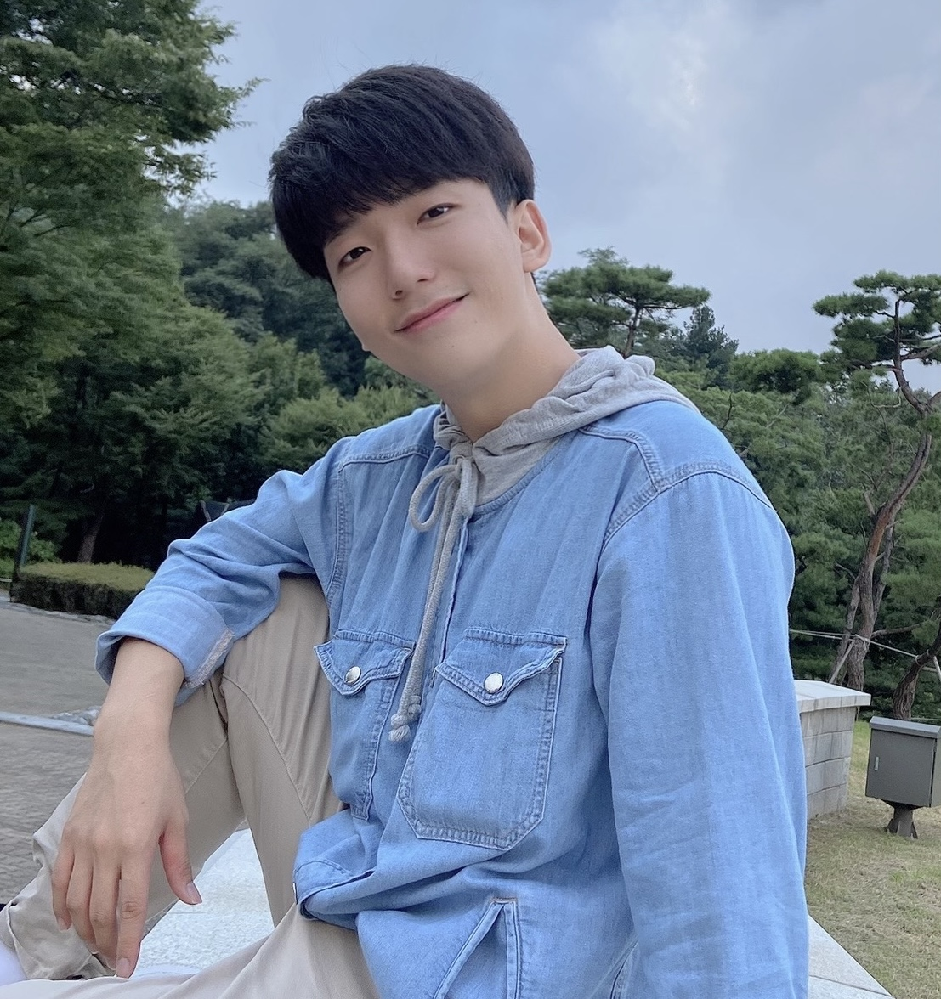

## About Me

<a href="https://scholar.google.com/citations?user=085jNAMAAAAJ&hl=en">Chanjun Park</a> is a researcher in the field of Natural Language Processing (NLP), with a focus on Data-Centric AI, Machine Translation and Large Language Model (LLM). He is currently working as an Technical Leader (TL) at <a href="https://www.upstage.ai/">Upstage</a> LLM Team. He is currently interested in forming an LLM-based ecosystem and has created initiatives such as the <a href="https://arxiv.org/abs/2312.15166">SOLAR</a>, <a href="https://huggingface.co/spaces/upstage/open-ko-llm-leaderboard">Open Ko-LLM Leaderboard</a> and the <a href="https://en.upstage.ai/1tt">Up 1 Trillion Token Club</a>. In 2023, he received Ph.D. from Korea University under the supervision of Professor <a href="https://scholar.google.co.kr/citations?user=HMTkz7oAAAAJ&amp;hl=ko&amp;oi=ao">Heuiseok Lim</a> for the work on “Data-Centric Neural Machine Translation”. From 2018 to 2019, he worked at <a href="https://www.systransoft.com/">SYSTRAN</a>  as a Research Engineer. Chanjun is the founder and leader of the <a href="http://kunmt.org/">KU-NMT Group</a>, and has received the Naver Ph.D. Fellowship in 2021. He served as the Virtual Social Chair at <a href="https://coling2022.org/committee01">COLING 2022</a>, and is currently serving as the Program Chair for the <a href="https://www.winlp.org/">WiNLP Workshop</a> and Publication Chair for the <a href="https://dmlr.ai/organizers/">DMLR Workshop</a>. He has published more than 160 papers in the field of NLP. See CV for more information.

## Research Interest
Large Language Model (LLM), Data-Centric AI, Machine Translation

## Education
* **2019.09 - 2023.08**: Ph.D in Computer Science and Engineering, Korea University (Advisor: <a href="https://scholar.google.co.kr/citations?user=HMTkz7oAAAAJ&amp;hl=ko&amp;oi=ao">Heuiseok Lim</a>)   
* **2015.03 - 2019.02**: B.S. in Natural Language Processing & Creative Convergence, Busan University of Foreign Studies (BUFS) (Advisor: <a href="https://sites.google.com/site/pummoryu/home">Pum-mo Ryu</a>)   

## Professional Experience
* **2022.07 - Now**: [Upstage](https://www.upstage.ai/), Technical Leader (TL)  
* **2022.03 - 2023.07**: [Upstage](https://www.upstage.ai/), AI Research Engineer  
* **2018.09 - 2019.07**: [SYSTRAN](https://www.systransoft.com/), Research Engineer  
* **2018.06 - 2018.08**: [SYSTRAN](https://www.systransoft.com/), Research Engineer Intern 

## Academic Services
* **Program Chair**: [EMNLP 2023-Widening NLP (WiNLP) Workshop](https://www.winlp.org/)  
* **Publication Chair**: [ICLR 2024-Data-centric Machine Learning Research (DMLR) 2024](https://dmlr.ai/organizers/)  
* **Virtual Social Chair**: [COLING 2022](https://coling2022.org/committee01)  
* **Program committee**: [NAACL 2024-Industry Track](https://2024.naacl.org/calls/industry/), [ICML 2023-Data-centric Machine Learning Research (DMLR)](https://dmlr.ai/pc/), [ACL 2023-Industry Track](https://2023.aclweb.org/calls/industry_track/), [ACL 2023-BEA](https://sig-edu.org/bea/2023), [EACL 2023](https://2023.eacl.org/), [EACL 2023-Insights](https://insights-workshop.github.io/index), [ACL 2022-Insights](https://insights-workshop.github.io/2022/pc/), [NAACL 2022-Industry Track](https://aclanthology.org/2022.naacl-industry.pdf), Reviewer of ARR (2022~Current)   
* **Reviewer**: [ICLR 2024 Workshop Proposal Reviewing](https://iclr.cc/), [ETRI Journal](https://onlinelibrary.wiley.com/journal/22337326), [IEEE Access](https://ieeexplore.ieee.org/xpl/RecentIssue.jsp?punumber=6287639), [International Journal of Human-Computer Interaction](https://www.tandfonline.com/journals/hihc20), [Cybernetics and Systems](https://www.tandfonline.com/journals/ucbs20), [Applied Sciences](https://www.mdpi.com/journal/applsci), [Electronics](https://www.mdpi.com/journal/electronics), [Entropy](https://www.mdpi.com/journal/entropy), [Connection Science](https://www.tandfonline.com/journals/ccos20)  

## External Activities
* **Committee Member**: [AI Privacy Policy Council (AI 프라이버시 민·관 정책협의회)](https://www.youtube.com/watch?v=Z1GEsgLKzc4) 3분과 (투명성 확보), 2023.10~  
* **Advisor**: [National Information Society Agency](https://www.nia.or.kr/site/nia_kor/main.do), 2024.01  
* **Advisor**: [Ministry of Food and Drug Safety](https://www.mfds.go.kr/index.do), 2023.12~  
* **Advisor**: [Yonsei University-Institute of Language and Information Studies](https://ilis2.yonsei.ac.kr/ilis/index.do), 2023.12  
* **Advisor**: [Software Policy & Research Institute](https://spri.kr/), 2023.08  

## Publications
### Preprints 
1. [SOLAR 10.7B: Scaling Large Language Models with Simple yet Effective Depth Up-Scaling](https://arxiv.org/abs/2312.15166)  
Dahyun Kim, **Chanjun Park**, Sanghoon Kim, Wonsung Lee, Wonho Song, Yunsu Kim, Hyeonwoo Kim, Yungi Kim, Hyeonju Lee, Jihoo Kim, Changbae Ahn, Seonghoon Yang, Sukyung Lee, Hyunbyung Park, Gyoungjin Gim, Mikyoung Cha, Hwalsuk Lee, Sunghun Kim **(Equal Contribution(First Co-Author), Corresponding Author)**  
*arxiv, 2023* 

1. [Self-Improving-Leaderboard(SIL): A Call for Real-World Centric Natural Language Processing Leaderboards](https://arxiv.org/abs/2303.10888)  
**Chanjun Park**, Hyeonseok Moon, Seolhwa Lee, Jaehyung Seo, Sugyeong Eo, Heuiseok Lim  
*arxiv, 2023* 

2. [Language Chameleon: Transformation analysis between languages using Cross-lingual Post-training based on Pre-trained language models](https://arxiv.org/abs/2209.06422)  
Suhyune Son, **Chanjun Park**, Jungseob Lee, Midan Shim, Chanhee Lee, Yoonna Jang, Jaehyung Seo, Heuiseok Lim **(Equal Contribution(First Co-Author))**  
*arxiv, 2022* 

3. [There is no rose without a thorn: Finding weaknesses on BlenderBot 2.0 in terms of Model, Data and User-Centric Approach](https://arxiv.org/abs/2201.03239)  
Jungseob Lee, Suhyune Son, Midan Shim, Yujin Kim, **Chanjun Park**, Heuiseok Lim **(Equal Contribution(First Co-Author))**  
*arxiv, 2022* 

### Top Conference (Main / Workshop)
1. Hyper-BTS Dataset: Scalability and Enhanced Analysis of Back TranScription (BTS) for ASR Post-Processing   
**Chanjun Park**, Jaehyung Seo, Seolhwa Lee, Junyoung Son, Hyeonseok Moon, Sugyeong Eo, Chanhee Lee, Heuiseok Lim  
*EACL 2024 (Findings of EACL 2024)., 2024*  

1. Generative Interpretation: Toward Human-Like Evaluation for Educational Question-Answer Pair Generation   
Hyeonseok Moon, Jaewook Lee, Sugyeong Eo, **Chanjun Park**, Jaehyung Seo, Heuiseok Lim  
*EACL 2024 (Findings of EACL 2024)., 2024*  

1. [KEBAP: Korean Error Explainable Benchmark Dataset for ASR and Post-processing](https://aclanthology.org/2023.emnlp-main.292/)   
Seonmin Koo, **Chanjun Park**, Jinsung Kim, Jaehyung Seo, Sugyeong Eo, Hyeonseok Moon, Heuiseok Lim  **(Equal Contribution(First Co-Author))**  
*EMNLP 2023, 2023*  

2. [CHEF in the Language Kitchen: A Generative Data Augmentation Leveraging Korean Morpheme Ingredients](https://aclanthology.org/2023.emnlp-main.367/)   
Jaehyung Seo, Hyeonseok Moon, Jaewook Lee, Sugyeong Eo, **Chanjun Park**, Heuiseok Lim  
*EMNLP 2023, 2023*  

3. [Proceedings of the Seventh Widening NLP Workshop (WiNLP 2023)](https://aclanthology.org/2023.winlp-1.0/)  
Bonaventure F. P. Dossou, Isidora Tourni, Hatem Haddad, Shaily Bhatt, Fatemehsadat Mireshghallah, Sunipa Dev, Tanvi Anand, Weijia Xu, Atnafu Lambebo Tonja, Alfredo Gomez, **Chanjun Park**   
*EMNLP 2023, 2023*  

3. Alternative Speech: Complementary Method to Counter-Narrative for Better Discourse   
Seungyoon Lee, DaHyun Jung, **Chanjun Park**, Seolhwa Lee, Heuiseok Lim **(Equal Contribution(First Co-Author))**  
*ICDM 2023 - The First Workshop on Data-Centric AI, 2023* 

4. [Informative Evidence-guided Prompt-based Fine-tuning for English-Korean Critical Error Detection](http://www.afnlp.org/conferences/ijcnlp2023/proceedings/main-long/cdrom/pdf/2023.ijcnlp-long.22.pdf)  
DaHyun Jung, Sugyeong Eo, **Chanjun Park**, Hyeonseok Moon, Jaehyung Seo, Heuiseok Lim  
*IJCNLP-AACL 2023, 2023* 

5. [Synthetic Alone: Exploring the Dark Side of Synthetic Data for Grammatical Error Correction](https://arxiv.org/abs/2306.14377)  
**Chanjun Park**, Seonmin Koo, Seolhwa Lee, Jaehyung Seo, Sugyeong Eo, Hyeonseok Moon, Heuiseok Lim   
*ICML 2023 - Data-centric Machine Learning Research (DMLR) Workshop, 2023* 

6. [DMOps: Data Management Operation and Recipes](https://arxiv.org/abs/2301.01228)  
Eujeong Choi, **Chanjun Park** **(Corresponding Author)**  
*ICML 2023 - Data-centric Machine Learning Research (DMLR) Workshop, 2023* 

7. [Inter-Annotator Agreement in the Wild: Uncovering Its Emerging Roles and Considerations in Real-World Scenarios](https://arxiv.org/abs/2306.14373)  
NamHyeok Kim, **Chanjun Park** **(Corresponding Author)**  
*ICML 2023 - Data-centric Machine Learning Research (DMLR) Workshop, 2023* 

8. [Transcending Traditional Boundaries: Leveraging Inter-Annotator Agreement (IAA) for Enhancing Data Management Operations](https://arxiv.org/abs/2306.14374) (DMOps)  
Damrin Kim, NamHyeok Kim, **Chanjun Park** **(Corresponding Author)**, Harksoo Kim **(Corresponding Author)**   
*ICML 2023 - Data-centric Machine Learning Research (DMLR) Workshop, 2023* 

9. [Data-Driven Approach for Formality-Sensitive Machine Translation: Language-Specific Handling and Synthetic Data Generation](https://arxiv.org/abs/2306.14514)  
Seugnjun Lee, Hyeonseok Moon, **Chanjun Park**, Heuiseok Lim  
*ICML 2023 - Data-centric Machine Learning Research (DMLR) Workshop, 2023* 

10. Toward Practical Automatic Speech Recognition and Post-Processing: a Call for Explainable Error Benchmark Guideline  
Seonmin Koo, **Chanjun Park**, Jinsung Kim, Jaehyung Seo, Sugyeong Eo, Hyeonseok Moon, Heuiseok Lim **(Equal Contribution(First Co-Author))**  
*ICML 2023 - Data-centric Machine Learning Research (DMLR) Workshop, 2023* 

11. [Knowledge Graph-Augmented Korean Generative Commonsense Reasoning](https://arxiv.org/abs/2306.14470)  
Dahyun Jung, Jaehyung Seo, Jaewook Lee, **Chanjun Park**, Heuiseok Lim  
*ICML 2023 - Data-centric Machine Learning Research (DMLR) Workshop, 2023* 

12. [Improving Formality-Sensitive Machine Translation using Data-Centric Approaches and Prompt Engineering](https://aclanthology.org/2023.iwslt-1.40/)  
Seugnjun Lee, Hyeonseok Moon, **Chanjun Park**, Heuiseok Lim  
*IWSLT 2023 - ACL 2023, 2023*  

13. [PEEP-Talk: A Situational Dialogue-based Chatbot for English Education](https://aclanthology.org/2023.acl-demo.18/)  
Seugnjun Lee, Yoonna Jang, **Chanjun Park**, Jungseob Lee, Jaehyung Seo, Hyeonseok Moon, Sugyeong Eo, Seounghoon Lee, Bernardo Nugroho Yahya, Heuiseok Lim  
*ACL 2023 - Demo Track, 2023*  

14. [PicTalky: Augmentative and Alternative Communication for Language Developmental Disabilities](https://aclanthology.org/2022.aacl-demo.3/)  
**Chanjun Park**, Yoonna Jang, Seolhwa Lee, Jaehyung Seo, Kisu Yang, Heuiseok Lim  
*AACL-IJCNLP 2022 - Demo Track, 2022*  

15. [KU X Upstage's submission for the WMT22 Quality Estimation: Critical Error Detection Shared Task](https://www.statmt.org/wmt22/pdf/2022.wmt-1.56.pdf)  
Sugyeong Eo, **Chanjun Park**, Hyeonseok Moon, Jaehyung Seo, Heuiseok Lim  
*WMT 2022 - EMNLP 2022, 2022*  

16. [QUAK: A Synthetic Quality Estimation Dataset for Korean-English Neural Machine Translation](https://aclanthology.org/2022.coling-1.460/)  
Sugyeong Eo, **Chanjun Park**, Hyeonseok Moon, Jaehyung Seo, Gyeongmin Kim, Jungseob Lee, Heuiseok Lim
  
*COLING 2022, 2022*  

17. [Focus on FoCus: Is FoCus focused on Context, Knowledge and Persona?](https://aclanthology.org/2022.ccgpk-1.1/)  
SeungYoon Lee, Jungseob Lee, **Chanjun Park**, Sugyeong Eo, Hyeonseok Moon, Jaehyung Seo, Jeongbae Park, Heuiseok Lim  
*COLING 2022 - The 1st Workshop on Customized Chat Grounding Persona and Knowledge , 2022*  

18. [A Self-Supervised Automatic Post-Editing Data Generation Tool](https://arxiv.org/abs/2111.12284)  
Hyeonseok Moon, **Chanjun Park**, Sugyeong Eo, Jaehyung Seo, Seungjun Lee, Heuiseok Lim  
*ICML 2022 - DataPerf workshop, 2022*  

19. [A Dog Is Passing Over The Jet? A Text-Generation Dataset for Korean Commonsense Reasoning and Evaluation](https://aclanthology.org/2022.findings-naacl.172/)  
Jaehyung Seo, Seounghoon Lee, **Chanjun Park**, Yoonna Jang, Hyeonseok Moon, Sugyeong Eo, Seonmin Koo, Heuiseok Lim  
*NAACL 2022 - Findings, 2022* 

20. [Priming Ancient Korean Neural Machine Translation](http://www.lrec-conf.org/proceedings/lrec2022/pdf/2022.lrec-1.3.pdf)  
**Chanjun Park**, Seolhwa Lee, Hyeonseok Moon, Sugyeong Eo, Jaehyung Seo, Heuiseok Lim  
*LREC 2022, 2022 - (Oral presentation)* 

21. [FreeTalky: Don’t Be Afraid! Conversations Made Easier by a Humanoid Robot using Persona-based Dialogue](http://www.lrec-conf.org/proceedings/lrec2022/pdf/2022.lrec-1.132.pdf)  
**Chanjun Park**, Yoonna Jang, Seolhwa Lee, Sungjin Park, Heuiseok Lim 
*LREC 2022, 2022 - (Poster)* 

22. [Empirical Analysis of Synthetic Data Generation Using Noising Strategies for Automatic Post-editing](http://www.lrec-conf.org/proceedings/lrec2022/pdf/2022.lrec-1.93.pdf)  
Hyeonseok Moon, **Chanjun Park**, Seolhwa Lee, Jaehyung Seo, Jeongsub Lee, Sugyeong Eo, Heuiseok Lim  
*LREC 2022, 2022 - (Poster)* 

23. [FreeTalky: Don’t Be Afraid! Conversations Made Easier by a Humanoid Robot using Persona-based Dialogue](https://arxiv.org/abs/2112.04126)  
**Chanjun Park**, Yoonna Jang, Seolhwa Lee, Sungjin Park, Heuiseok Lim 
*AAAI 2022 -Artificial Intelligence for Education(AI4EDU), 2022* 

24. [How should human translation coexist with NMT? Efficient tool for building high quality parallel corpus](https://arxiv.org/abs/2111.00191)  
**Chanjun Park**, Seolhwa Lee, Hyeonseok Moon, Sugyeong Eo, Jaehyung Seo, Heuiseok Lim  
*NeurIPS 2021 - Data-centric AI (DCAI) workshop, 2021* 

25. [A New Tool for Efficiently Generating Quality Estimation Datasets](https://arxiv.org/abs/2111.00767)  
Sugyeong Eo, **Chanjun Park**, Jaehyung Seo, Hyeonseok Moon, Heuiseok Lim  
*NeurIPS 2021 - Data-centric AI (DCAI) workshop, 2021* 

26. [Automatic Knowledge Augmentation for Generative Commonsense Reasoning](https://arxiv.org/abs/2111.00192)  
Jaehyung Seo, **Chanjun Park**, Sugyeong Eo, Hyeonseok Moon, Heuiseok Lim  
*NeurIPS 2021 - Data-centric AI (DCAI) workshop, 2021* 

27. [Syntax-enhanced Dialogue Summarization using Syntax-aware information](https://www.researchgate.net/publication/357602112_Syntax-enhanced_Dialogue_Summarization_using_Syntax-aware_information)  
Seolhwa Lee, Kisu Yang, **Chanjun Park**, João Sedoc, Heuiseok Lim 
*NeurIPS 2021 - Women in Machine Learning (WiML 2021) workshop, 2021 - (Contributed Talk / Oral presentation)* 

28. [Towards Syntax-Aware Dialogue Summarization using Multi-task Learning](http://www.winlp.org/wp-content/uploads/2021/11/winlp2021_55_Paper.pdf) 
Seolhwa Lee, Kisu Yang, **Chanjun Park**, João Sedoc, Heuiseok Lim 
*EMNLP 2021 -Widening NLP (WiNLP2021) workshop, 2021 - (Poster)* 

29. [Two Heads are Better than One? Verification of Ensemble Effect in Neural Machine Translation](https://aclanthology.org/2021.insights-1.4/) 
**Chanjun Park**, Sungjin Park, Seolhwa Lee, Taesun Whang, Heuiseok Lim 
*EMNLP 2021 -The Second Workshop on Insights from Negative Results in NLP, 2021 - (Oral presentation)* 

30. [BTS: Back TranScription for Speech-to-Text Post-Processor using Text-to-Speech-to-Text](https://aclanthology.org/2021.wat-1.10/) 
**Chanjun Park**, Jaehyung Seo, Seolhwa Lee, Chanhee Lee, Hyeonseok Moon, Sugyeong Eo, Heuiseok Lim 
*ACL 2021 -WAT(Workshop on Asian Translation) 2021 Workshop, 2021 - (oral presentation)* 

31. [Dealing with the Paradox of Quality Estimation](https://aclanthology.org/2021.mtsummit-LoResMT.1/)  
Sugyeong Eo, **Chanjun Park**, Jaehyung Seo, Hyeonseok Moon, Heuiseok Lim **(Equal Contribution(First Co-Author))**  
*MT Summit 2021 - LoResMT, 2021 - (Oral presentation)* 

32. [Should we find another model?: Improving Neural Machine Translation Performance with ONE-Piece Tokenization Method without Model Modification](https://aclanthology.org/2021.naacl-industry.13/) 
**Chanjun Park**, Sugyeong Eo, Hyeonseok Moon, Heuiseok Lim 
*NAACL-HLT 2021 Industry Track, 2021- (Poster/Oral presentation)* 

### International Journal (SCI/SCIE)
1. [Enhancing Machine Translation Quality Estimation via Fine-grained Error Analysis and Large Language Model](https://www.mdpi.com/2227-7390/11/19/4169)  
Dahyun Jung, **Chanjun Park**, Sugyeong Eo, Heuiseok Lim  
*Mathematics, 2023*  

1. [Uncovering the Risks and Drawbacks Associated with the Use of Synthetic Data for Grammatical Error Correction](https://ieeexplore.ieee.org/document/10234394)  
Seonmin Koo, **Chanjun Park**, Seolhwa Lee, Jaehyung Seo, Sugyeong Eo, Hyeonseok Moon, Heuiseok Lim   **(Equal Contribution(First Co-Author))**   
*IEEE Access, 2023* 

2. [Doubts on the Reliability of Parallel Corpus Filtering](https://www.sciencedirect.com/science/article/abs/pii/S0957417423014641?CMX_ID=&SIS_ID=&dgcid=STMJ_AUTH_SERV_PUBLISHED&utm_acid=270987895&utm_campaign=STMJ_AUTH_SERV_PUBLISHED&utm_in=DM389854&utm_medium=email&utm_source=AC_)  
Hyeonseok Moon, **Chanjun Park** , Seonmin Koo, Jungseob Lee, Seungjun Lee, Jaehyung Seo, Sugyeong Eo, Yoonna Jang, Hyunjoong Kim, Hyoung-gyu Lee, Heuiseok Lim  
*Expert Systems With Applications, 2023*  

3. [A Survey on Evaluation Metrics for Machine Translation](https://www.mdpi.com/2227-7390/11/4/1006)  
Seungjun Lee, Jungseob Lee, Hyeonseok Moon, **Chanjun Park**, Jaehyung Seo, Sugyeong Eo, Seonmin Koo, Heuiseok Lim  
*Mathematics, 2023*  

2. [K-NCT: Korean Neural Grammatical Error Correction Gold-Standard Test Set Using Novel Error Type Classification Criteria](https://ieeexplore.ieee.org/document/9938990)  
Seonmin Koo, **Chanjun Park**, Jaehyung Seo, Seungjun Lee, Hyeonseok Moon, Jungseob Lee, Heuiseok Lim **(Equal Contribution(First Co-Author))**   
*IEEE Access, 2022* 

3. [Plain Template Insertion: Korean-Prompt-based Engineering for Few-shot Learners](https://ieeexplore.ieee.org/document/9913979)  
Jaehyung Seo, Hyeonseok Moon, Chanhee Lee, Sugyeong Eo, **Chanjun Park**, Jihoon Kim, Changwoo Chun, Heuiseok Lim  
*IEEE Access, 2022* 

4. [The ASR post-processor performance challenges of BackTranScription (BTS) : Data-Centric and Model-Centric Approaches](https://www.mdpi.com/2227-7390/10/19/3618)  
**Chanjun Park**, Jaehyung Seo, Seolhwa Lee, Chanhee Lee, Heuiseok Lim  
*Mathematics, 2022*  

5. [PU-GEN: Enhancing Generative Commonsense Reasoning for Language Models with Human-Centered Knowledge](https://www.sciencedirect.com/science/article/abs/pii/S0950705122009546)  
Jaehyung Seo, Dongsuk Oh, Sugyeong Eo, **Chanjun Park**, Kisu Yang, Hyeonseok Moon, Kinam Park, Heuiseok Lim  
*Knowledge-Based Systems, 2022* 

6. [Utilization Strategy of User Engagements in Korean Fake News Detection](https://ieeexplore.ieee.org/document/9841541)  
Myunghoon Kang, Jaehyung Seo, **Chanjun Park**, Heuiseok Lim  
*IEEE Access, 2022* 

7. [BERTOEIC: Solving TOEIC Problems Using Simple and Efficient Data Augmentation Techniques with Pretrained Transformer Encoders](https://www.mdpi.com/2076-3417/12/13/6686)  
Jeongwoo Lee, Hyeonseok Moon, **Chanjun Park**, Jaehyung Seo, Sugyeong Eo, Heuiseok Lim  
*Applied Sciences, 2022* 

8. [Empirical Analysis of Parallel Corpora and in-depth Analysis using LIWC](https://www.mdpi.com/2076-3417/12/11/5545)  
**Chanjun Park**, Midan Shim, Sugyeong Eo, Seolhwa Lee, Jaehyung Seo, Hyeonseok Moon, Heuiseok Lim  
*Applied Sciences, 2022* 

9. [AI for Patents: A Novel yet Effective and Efficient Framework for Patent Analysis](https://ieeexplore.ieee.org/document/9779775)  
Junyoung Son, Hyeonseok Moon, Jeongwoo Lee, Seolhwa Lee, **Chanjun Park**, Wonkyung Jung, Heuiseok Lim  
*IEEE Access, 2022* 

10. [AI student: A Machine Reading Comprehension System for the Korean College Scholastic Ability Test](https://www.mdpi.com/2227-7390/10/9/1486)  
Gyeongmin Kim, Soomin Lee, **Chanjun Park**, Jaechoon Jo  
*Mathematics, 2022*  

11. [Return on Advertising Spend Prediction with Task Decomposition based LSTM Model](https://www.mdpi.com/2227-7390/10/10/1637)  
Hyeonseok Moon, Taemin Lee, Jaehyung Seo, **Chanjun Park**, Sugyeong Eo, Imatitikua D. AIyanyo, Jeongbae Park, Aram So, Kyoungwha Ok, Kinam Park   
*Mathematics, 2022*  

12. [Word-level Quality Estimation for Korean-English Neural Machine Translation](https://ieeexplore.ieee.org/document/9761258)  
Sugyeong Eo, **Chanjun Park**, Hyeonseok Moon, Jaehyung Seo, Heuiseok Lim **(Equal Contribution(First Co-Author))**  
*IEEE Access, 2022* 

13. [Dense-to-Question and Sparse-to-Answer: Hybrid Retriever System for Industrial Frequently Asked Questions](https://www.mdpi.com/2227-7390/10/8/1335)  
Jaehyung Seo, Taemin Lee, Hyeonseok Moon, **Chanjun Park**, Sugyeong Eo, Imatitikua D AIyanyo, Kinam Park, Aram So, Sungmin Ahn, Jeongbae Park  
*Mathematics, 2022*  

14. [Mimicking Infants’ Bilingual Language Acquisition for Domain Specialized Neural Machine Translation](https://ieeexplore.ieee.org/document/9751075) 
**Chanjun Park**, Woo-Young Go, Sugyeong Eo, Hyeonseok Moon, Seolhwa Lee, Heuiseok Lim  
*IEEE Access, 2022* 

15. [An Automatic Post Editing with Efficient and Simple Data Generation Method](https://ieeexplore.ieee.org/document/9714400) 
Hyeonseok Moon, **Chanjun Park**, Jaehyung Seo, Sugyeong Eo, Heuiseok Lim **(Equal Contribution(First Co-Author))**  
*IEEE Access, 2022* 

16. [Who speaks like a style of Vitamin: Towards Syntax-Aware Dialogue Summarization using Multi-task Learning](https://ieeexplore.ieee.org/document/9664379/) 
Seolhwa Lee, Kisu Yang, **Chanjun Park**, João Sedoc, Heuiseok Lim 
*IEEE Access, 2021* 

17. [Grounded Vocabulary for Image Retrieval Using a Modified Multi-Generator Generative Adversarial Network](https://ieeexplore.ieee.org/document/9585128) 
Kuekyeng Kim, **Chanjun Park**, Jaehyung Seo, Heuiseok Lim 
*IEEE Access, 2021* 

18. [An Empirical Study on Automatic Post Editing for Neural Machine Translation](https://ieeexplore.ieee.org/document/9528385)  
Hyeonseok Moon, **Chanjun Park**, Sugyeong Eo, Jaehyung Seo, Heuiseok Lim **(Equal Contribution(First Co-Author))**  
*IEEE Access, 2021* 

19. [Variational Reward Estimator Bottleneck: Towards Robust Reward Estimator for Multi-Domain Task-Oriented Dialogue](https://www.mdpi.com/2076-3417/11/14/6624)  
Jeiyoon Park, Chanhee Lee, **Chanjun Park**, Kuekyeng Kim, Heuiseok Lim  
*Applied Sciences, 2021* 

20. [Comparative Analysis of Current Approaches to Quality Estimation for Neural Machine Translation](https://www.mdpi.com/2076-3417/11/14/6584) 
Sugyeong Eo, **Chanjun Park**, Hyeonseok Moon, Jaehyung Seo, Heuiseok Lim **(Equal Contribution(First Co-Author))**  
*Applied Sciences, 2021* 

21. [Exploring the Data Efficiency of Cross-Lingual Post-Training in Pretrained Language Models](https://www.mdpi.com/2076-3417/11/5/1974) 
Chanhee Lee, Kisu Yang, Taesun Whang, **Chanjun Park**, Andrew Matteson, Heuiseok Lim 
*Applied Sciences, 2021* 

22. [Decoding Strategies for Improving Low-Resource Machine Translation](https://www.mdpi.com/2079-9292/9/10/1562)  
**Chanjun Park**, YeongWookYang, Kinam Park, Heuiseok Lim  
*Electronics, 2020* 

23. [Ancient Korean Neural Machine Translation](https://ieeexplore.ieee.org/abstract/document/9125904)  
**Chanjun Park**, Chanhee Lee, YeongWookYang, Heuiseok Lim  
*IEEE Access, 2020* 

24. [Comparison of the evaluation metrics for Neural Grammatical Error Correction with Overcorrection](https://ieeexplore.ieee.org/document/9102992)  
**Chanjun Park**, YeongWookYang, Chanhee Lee, Heuiseok Lim  
*IEEE Access, 2020* 

25. [Neural Spelling Correction: Translating Incorrect sentences to Correct sentences for Multimedia](https://link.springer.com/article/10.1007/s11042-020-09148-2)  
**Chanjun Park**, Kuekyeng Kim, YeongWookYang, Minho Kang, Heuiseok Lim  
*Multimedia Tools and Applications, 2020* 

### International & Domestic Conference
* **Domestic Journal (KCI)**: 20 papers  
* **Domestic Conference**: 57 papers  
* **International Conference (Excluding Top-Conference)**: 34 papers  

### Book Chapters
1. Data-Centric Neural Machine Translation - A Real-World Approaches  
**Chanjun Park** 
*Ph.D. Thesis*  

2. [Natural Langugae Processing Bible](https://www.aladin.co.kr/shop/wproduct.aspx?partner=rss&ISBN=K412637214) 
HeuiSeok Lim, **Korea University NLP&AI Lab**  
*Human Science*

### International Patents
1. METHOD FOR GENERATING TRAINING DATA AND METHOD FOR POST-PROCESSING OF SPEECH RECOGNITION USING THE SAME  
HeuiSeok Lim, **Chanjun Park** 
*Apply for a patent (17/739,383)*  

2. METHOD OF BUILDING TRAINING DATA OF MACHINE TRANSLATION  
HeuiSeok Lim, **Chanjun Park** 
*Apply for a patent (PCT/KR2021/012195)*  

### Domestic Patents
1. DEVICE AND METHOD FOR GENERATING OF TRAINING DATA FOR QUALITY ESTIMATION IN MACHINE TRANSLATION  
HeuiSeok Lim, Sugyeong Eo, **Chanjun Park**, Hyeonseok Moon  
*Granted Patent (10-2593447)*  

2. APPRATUS FOR CORPUS PROCESSING, APPARATUS AND METHOD AND MATHINE TRANSLATION  
**Chanjun Park**, HeuiSeok Lim  
*Granted Patent (10-2574167)*  

3. DEVICE AND METHOD FOR GENERATING TRAINING DATA FOR AUTOMATIC POST EDITING  
HeuiSeok Lim, Hyeonseok Moon, **Chanjun Park**, Sugyeong Eo  
*Apply for a patent (10-2021-0118924)*  

4. DEVICE AND METHOD FOR GENERATING OPTIMAL TRANSLATION SUBTITLE USING QUALITY ESTIMATION  
HeuiSeok Lim, **Chanjun Park**  
*Apply for a patent (10-2021-0117011)*  

5. Improving speech recognition performance using TTS in domain-specific environment  
HeuiSeok Lim, **Chanjun Park**  
*Apply for a patent (10-2021-0028816)*  

6. Method For Generating Training Data And Method For Post-Processing Of Speech Recognition Using The Same  
HeuiSeok Lim, **Chanjun Park**  
*Granted Patent (10-2557810)*  

7. METHOD OF BUILDING TRAINING DATA OF MACHINE TRANSLATION  
HeuiSeok Lim, **Chanjun Park**  
*Granted Patent (10-2409667)*  

8. Correction performance evaluation metrics of neural network machine translation and method of constructing the same  
HeuiSeok Lim, **Chanjun Park**  
*Granted Patent (10-2390154)*  

9. APPARATUS AND METHOD FOR OUTPUTTING IMAGE CORRESPONDING TO LANGUAGE  
HeuiSeok Lim, **Chanjun Park**, Yanghee Kim  
*Granted Patent  (10-2476497)*  

10. METHOD OF TRANSLATING ANCIENT KOREAN USING MACHINE TRANSLATION  
HeuiSeok Lim, **Chanjun Park**  
*Granted Patent (10-2425922)*  

11. Device and method for correcting Korean spelling  
HeuiSeok Lim, **Chanjun Park**  
*Granted Patent (10-2430918)*  

## Teaching
1. [Language Model to Large Language Model (LM to LLM)](https://fastcampus.co.kr/b2g_kdigitaltraining_ai), Instructor, Fast Campus. (2023)  
2. [Natural Language Processing (NLP) Basic](https://fastcampus.co.kr/b2g_kdigitaltraining_ai), Instructor, Fast Campus. (2023)  
3. [Learning ChatGPT Utilization and Service Construction with AskUP](https://fastcampus.co.kr/data_online_askup), Instructor, Fast Campus. (2023)  
4. Finance Specialized Large Language Model for Everyone, Instructor, Upstage Online Course. (2023)  
5. [Data-Centric NLP](https://boostcamp.connect.or.kr/program_ai.html), Master (Instructor), BoostCamp - NAVER Connect Foundation. (2023)  
6. [Introduction to Natural Language Processing in Big Data (BDC101)](https://github.com/Parkchanjun/KU-NLP-2020-1), Teaching Assistant, Korea Univ. (Autumn 2021)  
7. [Introduction to Natural Language Processing in Big Data (BDC101)](https://github.com/Parkchanjun/KU-NLP-2020-1), Head Teaching Assistant, Korea Univ. (Autumn 2020)  
8. [Natural Language Processing for Digital Finance Engineering (DFE610)](https://github.com/Parkchanjun/KU-NLP-2020-1), Head Teaching Assistant, Korea Univ. (Autumn 2020)  
9. [Natural Language Processing (COSE461)](https://github.com/Parkchanjun/KU-NLP-2020-1), Teaching Assistant, Korea Univ. (Spring 2020)  
10. [Artificial Intelligence and Natural Language Processing (DFC615)](https://github.com/Parkchanjun/KU-NLP-2020-1), Teaching Assistant, Korea Univ. (Spring 2020)  

## Honors & Awards

Year | Award
:-----:|-------
2023.10 | Best Paper Award, The 35th Annual Conference on Human & Cognitive Language Technology (HCLT2023) - Language Model 2 Section
2023.10 | Best Paper Award, The 35th Annual Conference on Human & Cognitive Language Technology (HCLT2023) - Data Bias & Ethics Section
2023.02 | Best Paper Award, Korea University
2023.02 | Research Encouragement Scholarship, Korea University
2022.12 | 1st place in Quality Estimation Shared Task 2022 - Sentence-level "Critical Error Detection", WMT 2022 (EMNLP 2022)
2022.10 | Best Paper Award, The 34th Annual Conference on Human & Cognitive Language Technology (HCLT2022)
2021.12 | Naver Ph.D. Fellowship 2021
2021.10 | Best Paper Award, The 33rd Annual Conference on Human & Cognitive Language Technology (HCLT2021) - NLP Application 2 Section
2021.10 | Best Paper Award, The 33rd Annual Conference on Human & Cognitive Language Technology (HCLT2021) - Language Resource Section
2021.10 | Best Paper Award, The 33rd Annual Conference on Human & Cognitive Language Technology (HCLT2021) - QA and Speech Section
2021.07 | [Ranked 4th on the CommonGen 1.1 Leaderboard (Nov. 2022 Ranked 7th, CommonGen 1.1)](https://inklab.usc.edu/CommonGen/leaderboard.html)
2020.11 | [1st Place in Flitto Hackathon (Team Lead)](https://www.flitto.com/business/blog/6547023368438992855?country=ko)
2020.10 | Best Paper Award, The 32nd Annual Conference on Human & Cognitive Language Technology (HCLT2020)
2020.05 | [Best practices for using NIA AI training data(Korean-English Neural Machine Translation model)](http://aihub.or.kr/node/4525), NIA
2019.10 | Best Paper Award, The 31st Annual Conference on Human & Cognitive Language Technology (HCLT2019)  
2019.10 | [1st Place Microsoft AI Accessibility Hackathon in Korea (Team Lead)](http://hiai.co.kr/news/?uid=52&mod=document), Microsoft
2019.03 | Graduate School Associate Scholarship, Sungkyunkwan University
2018.10 | [Next Generation Information Processing NLP Competition 2018: Participation Award](https://sites.google.com/site/koreanlp2018/), Next-generation information computing technology development business
2017.06 | Bit Computer Excellence Award (President Award), Bit Computer
2017.12 | Scholarship for academic excellence, Sooyoungro Church
2016.12 | Scholarship for academic excellence, Sooyoungro Church
2015.03 | Full Scholarship, BUFS

## Invited Talk

Year | Place | Contents
:-----:|-------|-------
2024.01 | [The University of Tokyo - Center for Data-Driven Discovery](https://cd3.ipmu.jp/ai4phys/)  |  SOLAR: The Next Frontier in Large Language Models by Upstage
2024.01 | Defense Agency for Technology and Quality (DTaQ)  |  Current State of Artificial Intelligence (AI) and Its Application Strategies in the Defense Sector
2024.01 | National Library of Korea  |  Upstage LLM One Pager
2023.12 | Ministry of Science and ICT - Data Utilization Council  |  Upstage LLM One Pager
2023.12 | [Seoul Metropolitan Office of Education-AI & Digital Education Conference](https://sites.google.com/kdai.re.kr/2023/%ED%99%88?authuser=0) |  Reset Moment by Large Language Model
2023.12 | [Korean-English Joint Seminar on Artificial Intelligence (AI) Safety and Reliability](https://www.tta.or.kr/tta/selectBbsNttView.do?key=74&bbsNo=105&nttNo=13121&fbclid=IwAR2XW8KEGB6sBCmKk20HvIuZ9SP9QjiyfQ7dB1XhMy5k1PI31tHOa-6Kcno) |  Upstage Vision for Ethical and Trustworthy Large Language Models
2023.11 | Digital Innovation Forum (Ministry of Culture, Sports and Tourism) |  [Generative AI era: Copyright issues and countermeasures](https://www.culture.go.kr/digicon/sub02/sub04.php)
2023.11 | Kyungpook National University  |  Upstage LLM One Pager
2023.11 | Future Technology Exchange Conference in Southeast Region  |  Upstage LLM One Pager
2023.11 | Jeju National University  |  Upstage LLM One Pager
2023.11 | Busan University of Foreign Studies  |  From Language Model to Large Language Model
2023.11 | KB Kookmin Bank  |  Areas of Generative AI Application in Business
2023.11 | Human-Inspired AI Research  |  Upstage LLM One Pager
2023.10 | NIA |  Upstage LLM and latest B2B LLM trends
2023.09 | Woongjin Thinkbig |  Upstage LLM One Pager
2023.09 | Kyobo Life Insurance |  Upstage and Private LLM
2023.09 | HD Korea Shipbuilding & Offshore Engineering |  Upstage and Private LLM
2023.09 | Korea University |  From Language Model to Large Language Model
2023.09 | HanYang University |  [From Language Model to Large Language Model](https://gsai.hanyang.ac.kr/front/community/notice/view?id=164286)
2023.09 | Korea Institute of Patent Information |  Upstage LLM and latest B2B LLM trends
2023.09 | AGI Town in Seoul|  [The use case of solving customer problems using LLM](https://lu.ma/agitown6th?fbclid=IwAR3mN2XZcC3Pv4s5iqKOfrlMu-L0jSjqHSyD4Kbzim6PW6Rj12HKk-i7tco&utm_campaign=6th&utm_medium=agitown&utm_source=fb)
2023.09 | Fast Campus |  Job Employment Special Lecture
2023.08 | HD Korea Shipbuilding & Offshore Engineering |  Upstage LLM and latest B2B LLM trends
2023.08 | Upstage Webinar |  [The Future of Finance/Insurance Transformed by Generative AI](https://www.upstage.ai/webinar/fintech-insuretech-genai?utm_source=starshare&utm_medium=share&utm_campaign=finwgenai&fbclid=IwAR3xI_mqqbYjUNzqSlNfCsGPK2ZgyRK_lIxsAmoA54kWZ6YiPE2Ce_LodBM)
2023.08 | Google I/O Extended 2023 Incheon |  [From Language Model to Large Language Model](https://festa.io/events/3780)
2023.07 | POSCO RIST |  Data-Centric AI in Real-World
2023.07 | Google I/O Extended 2023 Seoul |  [From Language Model to Large Language Model](https://festa.io/events/3683)
2023.07 | TensorFlow Korea LLM Day |  [Language Model to Large Language Model](https://festa.io/events/3717)
2023.07 | Jeju National University |  Real-World Artificial Intelligence and Large Language Model for Everyone
2023.06 | AI EDucation Alliance Policy lab (AIEDAP) |  Deep Learning Understanding and Practice
2023.05 | KIDA (Korea Institute for Defense Analysis) |  Data-Centric AI in the Large Language Model Era
2023.04 | Upstage |  NLP based Large Language Model for All
2023.02 | AI·DATA SUMMIT 2023 |  [Real-World Centric AI](https://www.aitimes.kr/event/event17.html), [(Video)](https://www.youtube.com/watch?v=20NXHKGV3uI&t=116s)
2022.12 | Sunmoon University |  Real-World Centric AI
2022.08 | Kyungsung University |  Language and Information Studies and the Future of Artificial Intelligence
2022.07 | Hankuk University of Foreign Studies |  Basic practice of natural language processing for everyone
2022.01 | Dongguk University |  Artificial intelligence and Machine Translation
2021.07 | Busan Social Welfare Development Group |  Attending advisory meetings and Focus Group Interview
2020.03 | LLsoLLu |  Latest natural language processing Research
2020.02 | NC SOFT |  Technology Transfer Seminar
2020.01 | Dongguk University |  [A.I - NLP - MT for Liberal Arts](https://github.com/Parkchanjun/Dongguk_AI_NLP_MachineTranslation)
2019.10-2019.11 | SKC  |  [Text Preprocessing, Machine Translation, Language Embedding](https://github.com/Parkchanjun/SKC_MachineTranslation)
2019.08 | SK T Academy  |  [Machine Translation for everyone](https://www.youtube.com/watch?v=3WvA-sFiI6w&list=PL9mhQYIlKEhcyCTvJq6tGJ3_B6hRjLm2N)
2019.08 | NAVER |  [Machine Translation for everyone](https://tv.naver.com/v/9906991)

## Newspaper Article (Press)

Year | Headline | Press
:-----:|-------|-------
2024.01 | [버티컬 시장에 쏠리는 눈...AI발 M&A 슈퍼사이클 열린다](https://www.etoday.co.kr/news/view/2318763) |  이투데이
2023.12 | [과기정통부, 제4회 AI 데이터 활용협의회 개최](https://www.asiatoday.co.kr/view.php?key=20231221010012919) |  아시아투데이 등 다수 언론사
2023.12 | [서울교육청, 16일 'AI·디지털 교육 컨퍼런스' 개최](https://www.edaily.co.kr/news/read?newsId=02341926635838520&mediaCodeNo=257&OutLnkChk=Y) |  이데일리 등 다수 언론사
2023.12 | [업스테이지 연구진, '초거대 언어모델 연구 동향' 이라는 한국어 LLM 서베이 논문 공개](https://www.aitimes.kr/news/articleView.html?idxno=29669) |  인공지능 신문
2023.12 | [구글 건재 보여준 AI ‘제미나이’… 전문가 “GPT-4 능가하진 않아”](https://www.munhwa.com/news/view.html?no=2023120801071407275001) |  문화일보
2023.12 | [구글 '제미나이'로 AI 공세…평가는 “글쎄”](https://n.news.naver.com/mnews/article/030/0003163809?sid=105) |  전자신문
2023.12 | [떠오르는 '미스트랄 7B'...'라마 2' 이어 한국어 모델 세대교체 주도](https://www.aitimes.com/news/articleView.html?idxno=155624) |  AI TIMES
2023.11 | [논문 쓰는 회사들… AI 기술기업들 유력 저널에 게재](https://n.news.naver.com/article/081/0003411469?sid=101) |  서울신문
2023.11 | [강화학습법 'DPO', 'RLHF' 대안으로 인기...마커AI 1위 탈환](https://www.aitimes.com/news/articleView.html?idxno=155284) |  AI TIMES
2023.10 | ['글로벌 AI 규범, 민·관이 함께!'... 개인정보위, ‘인공지능 프라이버시 민·관 정책협의회’ 출범](https://www.aitimes.kr/news/articleView.html?idxno=29251) |  AI TIMES 등 다수 언론사
2023.10 | [인공지능 자연어처리 세계 최고 기술 기업으로...업스테이지, NLP 최고 권위 EMNLP 2023에 논문 2편 채택](https://www.aitimes.kr/news/articleView.html?idxno=29194) |  AI TIMES 등 다수 언론사
2023.10 | [마커AI, 차트를 점령하다...최초 1위는 옴니어스닷AI](https://www.aitimes.com/news/articleView.html?idxno=154236) |  AI TIMES
2023.09 | [NIA, 글로벌 LLM 플랫폼 '업스테이지'와 국내 '초거대 언어 모델' 생태계 활성화에 기반 다진다!](https://www.aitimes.kr/news/articleView.html?idxno=28851) |  인공지능신문
2023.09 | [한국어 데이터 토큰 1조개 함께 모으자](https://www.hani.co.kr/arti/economy/it/1106968.html) |  한겨레
2023.08 | [기업 맞춤용 챗GPT 쓰세요" 오픈AI 급하게 만든 이 숫자](https://www.joongang.co.kr/article/25186967#home) |  중앙일보
2023.08 | [세계 1위 기술 증명...업스테이지에 '글로벌'은 도전 아닌 현실](https://www.aitimes.com/news/articleView.html?idxno=152958) |  AI TIMES
2023.08 | [챗GPT 제친 업스테이지 박찬준 리더 "협업이 AI 시장서 성패 가를 것"](https://www.etoday.co.kr/news/view/2277082) |  이투데이
2023.08 | [업스테이지, 금융권 특화 생성형AI 접목 노하우 공개한다](https://www.upstage.ai/newsroom/upstage-talks-financeai) |  뉴시스, 파이낸셜뉴스, 아시아투데이 등 다수 언론사
2023.07 | [AI시대, 데이터의 시대/박찬준 업스테이지 AI 리서치 엔지니어](https://www.seoul.co.kr/news/newsView.php?id=20230725025004&wlog_tag3=naver) |  서울신문
2023.07 | [데이터 AI 논문 7건, 세계적 학술지 채택](https://www.mk.co.kr/news/it/10792047) |  매일경제
2023.06 | [업스테이지, 글로벌 머신러닝 AI 학회서 논문 7편 채택](https://www.sedaily.com/NewsView/29QYSOIXML) |  매일경제, 서울경제, 디지털투데이, 이코노믹리뷰 등 30개 이상 언론사
2022.05 | [성장성·유연한 조직문화에 반했죠](https://www.sedaily.com/NewsView/265XEW0U0Z) |  서울경제

   
