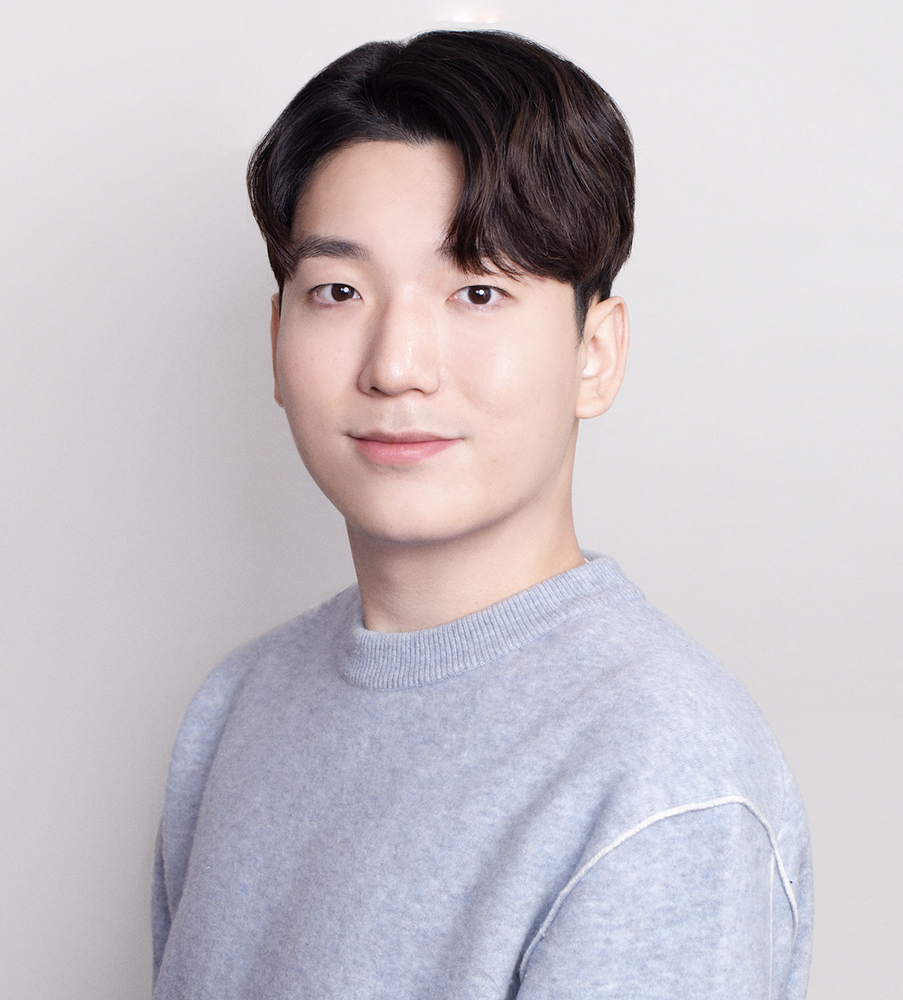

## Biography

<a href="https://scholar.google.com/citations?user=085jNAMAAAAJ&hl=en">Chanjun Park</a>  is an Assistant Professor in the <a href="https://sw.ssu.ac.kr/"> School of Software at Soongsil University</a>, where he serves as the Principal Investigator of the <a href="https://sites.google.com/view/ssu-nlp/home">Natural Language Processing Lab</a>. Prior to joining Soongsil University, he was a Research Professor at <a href="https://www.korea.edu/sites/en/index.do">Korea University</a>. Before that, he served as a Principal Research Engineer and Technical Leader of the Large Language Models (LLMs) team at <a href="https://www.upstage.ai/">Upstage</a>, where he contributed to building an ecosystem for LLMs. He also worked as a Research Engineer at <a href="https://www.systransoft.com/">SYSTRAN</a>, contributing to advancements in machine translation (MT) and automatic speech recognition (ASR) systems. He earned his Ph.D. in the Department of Computer Science and Engineering at Korea University under the supervision of Professor <a href="https://scholar.google.co.kr/citations?user=HMTkz7oAAAAJ&amp;hl=ko&amp;oi=ao">Heuiseok Lim</a>. He received the Naver Ph.D. Fellowship and was selected for the <a href="https://jmagazine.joins.com/forbes/view/339714">Forbes 30 Under 30 Korea</a>. For more details, please see his <a href="./Curriculum_Vitae_Chanjunpark__New_.pdf">CV</a>.

## Research Interest
My research philosophy is centered on service-driven research, aiming to bridge the gap between foundational theories in natural language processing (NLP) and their real-world applications. My primary interests include the development of efficient, purpose-trained Large Language Models (LLMs), with a focus on exploring their capability landscape across parameter regions and understanding how model scale and architecture shape emergent behaviors. I am also actively investigating how real-world phenomena can be systematically represented as text to enhance reasoning capabilities in LLMs. In addition, I am deeply engaged in cross-lingual NLP and multidisciplinary research that integrates insights from diverse domains to broaden the scope and impact of NLP technologies.

## News
* **2026**: I will serve as an Area Chair at **EACL 2026**.    
* **2025**: Seven papers (including three from Findings and one from Industry) have been accepted at **EMNLP 2025**. Among them, four papers are collaborative works with **Korea University**, one paper is a collaboration with **Chungnam National University**, another with **Yonsei University**, and one represents an industry–academia collaboration with **Upstage**. Notably, two of these papers were selected for **Oral** presentations.  
* **2025**: Six papers have been accepted to HCLT-KACL 2025, five of which were selected for Oral presentations. Among them, the research received the Best Paper Award and the Outstanding Paper Award at the conference. 
* **2025**: I have been selected for the **National Foundation Model Project (독자 AI 파운데이션모델 사업, K-AI 사업, 국가대표 LLM 프로젝트)**. I will be participating as part of the **NC AI Consortium**, together with Korea University, Seoul National University, Yonsei University, KAIST, ETRI, AIWorks, POSCO DX, Lotte Innovate, HL Robotics, InterX, MediaZen, MBC, and NHN.  
* **2025**: Two papers have been accepted at **CIKM 2025**. This research was conducted in collaboration with the **University of Tokyo** and **MIT**.    
* **2025**: I will serve as the Academic Chair (학술위원장) of  <a href="https://sites.google.com/view/hclt-2025/">HCLT-KACL 2025</a>.    
* **2025**: I will join the <a href="https://sw.ssu.ac.kr/">Department of Software at Soongsil University</a> as an Assistant Professor starting in September 2025.   
* **2025**: I will serve as an Area Chair at **EMNLP 2025**.    
* **2025**: Three papers (including one from SRW) have been accepted at **ACL 2025**.    
* **2025**: I will serve as an Area Chair at **ACL 2025**.    
* **2025**: Nine papers (including three from Findings, three from Industry and one from Demo) have been accepted at **NAACL 2025**.  
* **2025**: Two papers (including one from Industry) have been accepted at **COLING 2025**.   

* **2024**: After 2 years and 9 months at Upstage, I have joined **Korea University as a Research Professor**. 
* **2024**: Five papers (including two from Findings, one from Demo and one from Industry) have been accepted at **EMNLP 2024**.  
* **2024**: Three papers (including two Findings) have been accepted at **ACL 2024**.    
* **2024**: Three papers (including one from industry and two from SRW) have been accepted at **NAACL 2024**.  
* **2024**: Two papers have been accepted at **LREC-COLING 2024**.  
* **2024**: Two papers have been accepted at **EACL Findings 2024**.  
* **2024**: I was selected for **Forbes 30 Under 30 Korea**.   
* **2024**: I was selected to serve as the **Publication Chair** for **DMLR at ICLR 2024**.  
* **2024**: I was selected to serve as the **Program Chair** for **Widening NLP (WiNLP) Workshop at EMNLP 2024**.  

* **2023**: Two papers have been accepted at **EMNLP 2023**.  

## Education
* **2019.09 - 2023.08**: Ph.D in Computer Science and Engineering, Korea University (Advisor: <a href="https://scholar.google.co.kr/citations?user=HMTkz7oAAAAJ&amp;hl=ko&amp;oi=ao">Heuiseok Lim</a>)   
* **2015.03 - 2019.02**: B.S. in Natural Language Processing & Creative Convergence, Busan University of Foreign Studies (BUFS) (Advisor: <a href="https://sites.google.com/site/pummoryu/home">Pum-mo Ryu</a>)   

## Work Experiences
* **2025.09 - Now**: [Soongsil University](https://ssu.ac.kr/), Assistant Professor  
* **2024.12 - 2025.08**: [Korea University](https://cs.korea.edu/en_cs/index.do), Research Professor  
* **2022.03 - 2024.11**: [Upstage](https://www.upstage.ai/), Principal Research Engineer, Technical Leader (TL)  
* **2018.06 - 2019.07**: [SYSTRAN](https://www.systransoft.com/), Research Engineer  

## Academic Services
* **Program Chair (Organizer)**: [Widening NLP (WiNLP) Workshop at EMNLP 2023 & EMNLP 2024](https://aclanthology.org/2024.winlp-1.0.pdf)  
* **Publication Chair (Organizer)**: [Data-centric Machine Learning Research (DMLR) 2024 at ICLR 2024](https://openreview.net/pdf?id=5y6fLlZhcO)  
* **Virtual Social Chair (Organizer)**: [COLING 2022](https://coling2022.org/committee01)  
* **Academic Chair**: [HCLT-KACL 2025](https://sites.google.com/view/hclt-2025/)  
* **Area Chair**: ACL, EMNLP  
* **Program Committee (Reviewer)**: ACL, EMNLP, NAACL, EACL, COLING, WMT, ARR, ICML, NeurIPS, ICLR, AAAI   

## Publications  (Selected)
Please see my <a href="./Curriculum_Vitae_Chanjunpark__New_.pdf">CV</a> or <a href="https://scholar.google.com/citations?user=085jNAMAAAAJ&hl=en">Google Scholar profiles</a> for the full list.

### 2025 
1. [Mixture-of-Clustered-Experts: Advancing Expert Specialization and Generalization in Instruction Tuning](https://aclanthology.org/2025.emnlp-main.718/)  
Sugyeong Eo, Jung Jun Lee, **Chanjun Park (✝)**, Heuiseok Lim (✝)  
*EMNLP 2025 (Oral)* 

1. [Benchmark Profiling: Mechanistic Diagnosis of LLM Benchmarks](https://aclanthology.org/2025.emnlp-main.789/)  
Dongjun Kim, Gyuho Shim, Yongchan Chun, Minhyuk Kim, **Chanjun Park (✝)**, Heuiseok Lim (✝)  
*EMNLP 2025 (Oral)* 

1. [MultiDocFusion : Hierarchical and Multimodal Chunking Pipeline for Enhanced RAG on Long Industrial Documents](https://aclanthology.org/2025.emnlp-main.1062/)  
Joong Min Shin, **Chanjun Park**, Jeongbae Park, Jaehyung Seo, Heuiseok Lim 
*EMNLP 2025* 

1. [HAWK: Highlighting Entity-aware Knowledge for Alleviating Information Sparsity in Long Contexts](https://aclanthology.org/2025.findings-emnlp.708/)  
Seonmin Koo, Jinsung Kim, **Chanjun Park (✝)**, Heuiseok Lim (✝) 
*EMNLP 2025-Findings* 

1. [ZEBRA: Leveraging Model-Behavioral Knowledge for Zero-Annotation Preference Dataset Construction](https://aclanthology.org/2025.findings-emnlp.417/)  
Jeesu Jung, Jinsung Kim, **Chanjun Park (✝)**, Sangkeun Jung (✝) 
*EMNLP 2025-Findings* 

1. [Can Code-Switched Texts Activate a Knowledge Switch in LLMs? A Case Study on English-Korean Code-Switching](https://aclanthology.org/2025.findings-emnlp.1215/)  
Seoyeon Kim, Huiseo Kim, **Chanjun Park**, Jinyoung Yeo, Dongha Lee 
*EMNLP 2025-Findings* 

1. [LP Data Pipeline: Lightweight, Purpose-driven Data Pipeline for Large Language Models](https://aclanthology.org/2025.emnlp-industry.11/)  
Yungi Kim, Hyunsoo Ha, Seonghoon Yang, Sukyung Lee, Jihoo Kim, **Chanjun Park (✝)**  
*EMNLP 2025-Industry* 

1. [AGENTiGraph: A Multi-Agent Knowledge Graph Framework for Interactive, Domain-Specific LLM Chatbots](https://dl.acm.org/doi/10.1145/3746252.3761459)  
Xinjie Zhao, Moritz Blum, Fan Gao, Yingjian Chen, Boming Yang, Luis Marquez-Carpintero, Mónica Pina-Navarro, Yanran Fu, So Morikawa, Yusuke Iwasawa, Yutaka Matsuo, **Chanjun Park**, Irene Li  
*CIKM 2025-Demo* 

1. [HealthGenie: An Interactive Knowledge-Driven LLM Framework for Tailored Dietary Guidance](https://dl.acm.org/doi/10.1145/3746252.3761479)  
Fan Gao, Xinjie Zhao, Ding Xia, Zhongyi Zhou, Rui Yang, Jinghui Lu, Hang Jiang, **Chanjun Park**, Irene Li  
*CIKM 2025-Demo* 

1. [Rethinking KenLM: Good and Bad Model Ensembles for Efficient Text Quality Filtering in Large Web Corpora](https://aclanthology.org/2025.acl-short.4/)  
Yungi Kim, Hyunsoo Ha, Sukyung Lee, Jihoo Kim, Seonghoon Yang, **Chanjun Park (✝)**  
*ACL 2025* 

1. [Enhancing Automatic Term Extraction in Large Language Models via Syntactic Retrieval](https://aclanthology.org/2025.findings-acl.516/)  
Yongchan Chun, Minhyuk Kim, Dongjun Kim, **Chanjun Park (✝)**, Heuiseok Lim (✝)  
*ACL 2025-Findings* 

1. [From Ambiguity to Accuracy: The Transformative Effect of Coreference Resolution on RAG systems](https://aclanthology.org/2025.acl-srw.27/)  
Youngjoon Jang, Seongtae Hong, Junyoung Son, Sungjin Park, **Chanjun Park (✝)**, Heuiseok Lim (✝)  
*ACL 2025 - Student Research Workshop* 

3. [LCIRC: A Recurrent Compression Approach for Efficient Long-form Context and Query Dependent Modeling in LLMs](https://aclanthology.org/2025.naacl-long.524/)  
Sumin An, Junyoung Sung, Wonpyo Park, **Chanjun Park (✝)**, Paul Hongsuck Seo (✝)  
*NAACL 2025 (Oral)* 

1. [CoME: A Unlearning-based Approach to Conflict-free Model Editing](https://aclanthology.org/2025.naacl-long.325/)  
Dahyun Jung, Jaehyung Seo, Jaewook Lee, **Chanjun Park (✝)**, Heuiseok Lim (✝)  
*NAACL 2025* 

1. [MIRAGE: A Metric-Intensive Benchmark for Retrieval-Augmented Generation Evaluation](https://aclanthology.org/2025.findings-naacl.157/)  
Chanhee Park, Hyeonseok Moon, **Chanjun Park (✝)**, Heuiseok Lim (✝)  
*NAACL 2025-Findings* 

1. [FLEX: A Benchmark for Evaluating Robustness of Fairness in Large Language Models](https://aclanthology.org/2025.findings-naacl.199/)  
Dahyun Jung, Seungyoon Lee, Hyeonseok Moon, **Chanjun Park (✝)**, Heuiseok Lim (✝)  
*NAACL 2025-Findings* 

1. [Find the Intention of Instruction: Comprehensive Evaluation of Instruction Understanding for Large Language Models](https://aclanthology.org/2025.findings-naacl.330/)  
Hyeonseok Moon, Jaehyung Seo, Seungyoon Lee, **Chanjun Park (✝)**, Heuiseok Lim (✝)  
*NAACL 2025-Findings* 

1. [Open Ko-LLM Leaderboard2: Bridging Foundational and Practical Evaluation for Korean LLMs](https://aclanthology.org/2025.naacl-industry.22/)  
Hyeonwoo Kim, Dahyun Kim, Jihoo Kim, Sukyung Lee, Yungi Kim, **Chanjun Park (✝)**  
*NAACL 2025 - Industry, 2025* 

1. [Understanding LLM Development Through Longitudinal Study: Insights from the Open Ko-LLM Leaderboard](https://aclanthology.org/2025.naacl-industry.1/)  
**Chanjun Park (✝)**, Hyeonwoo Kim  
*NAACL 2025 - Industry, 2025* 

1. [CharacterGPT: A Persona Reconstruction Framework for Role-Playing Agents](https://aclanthology.org/2025.naacl-industry.24/)  
Jeiyoon Park, **Chanjun Park (✝)**, Heuiseok Lim (✝)  
*NAACL 2025 - Industry, 2025* 

4. [Dataverse: Open-Source ETL (Extract, Transform, Load) Pipeline for Large Language Models](https://aclanthology.org/2025.naacl-demo.1/)  
Hyunbyung Park, Sukyung Lee, Gyoungjin Gim, Yungi Kim, Dahyun Kim, **Chanjun Park (✝)**  
*NAACL 2025 - Demo, 2025* 

1. [Representing the Under-Represented: Cultural and Core Capability Benchmarks for Developing Thai Large Language Models](https://aclanthology.org/2025.coling-main.278/)  
Dahyun Kim, Sukyung Lee, Yungi Kim, Attapol Rutherford, **Chanjun Park (✝)**  
*COLING 2025* 

1. [sDPO: Don't Use Your Data All at Once](https://aclanthology.org/2025.coling-industry.31/)  
Dahyun Kim, Yungi Kim, Wonho Song, Hyeonwoo Kim, Yunsu Kim, Sanghoon Kim, **Chanjun Park (✝)**  
*COLING 2025 - Industry* 

1. [An analysis on language transfer of pre-trained language model with cross-lingual post-training](https://www.sciencedirect.com/science/article/pii/S0957417424027088)  
Suhyune Son (\*), **Chanjun Park (\*)**, Jungseob Lee (\*), Midan Shim (\*), Chanhee Lee, Yoonna Jang, Jaehyung Seo, Jungwoo Lim, Heuiseok Lim  
*Expert Systems with Applications, 2025* 

### 2024 
1. [Where am I? Large Language Models Wandering between Semantics and Structures in Long Contexts](https://aclanthology.org/2024.emnlp-main.783/)  
Seonmin Koo, Jinsung Kim, YoungJoon Jang, **Chanjun Park (✝)**, Heuiseok Lim (✝)   
*EMNLP 2024* 

1. [Search if you don't know! Knowledge-Augmented Korean Grammatical Error Correction with Large Language Models](https://aclanthology.org/2024.findings-emnlp.6/)  
Seonmin Koo, Jinsung Kim, **Chanjun Park (✝)**, Heuiseok Lim (✝)   
*EMNLP 2024-Findings* 

1. [Translation of Multifaceted Data without Re-Training of Machine Translation Systems](https://aclanthology.org/2024.findings-emnlp.114/)  
Hyeonseok Moon, Seungyoon Lee, Seongtae Hong, Seungjun Lee, **Chanjun Park** , Heuiseok Lim  
*EMNLP 2024-Findings* 

1. [SAAS: Solving Ability Amplification Strategy for Enhanced Mathematical Reasoning in Large Language Models](https://aclanthology.org/2024.emnlp-industry.15/)  
Hyeonwoo Kim, Gyoungjin Gim, Yungi Kim, Jihoo Kim, Byungju Kim, Wonseok Lee, **Chanjun Park (✝)**  
*EMNLP 2024 - Industry* 

1. [Evalverse: Unified and Accessible Library for Large Language Model Evaluation](https://aclanthology.org/2024.emnlp-demo.3/)  
Jihoo Kim, Wonho Song, Dahyun Kim, Yunsu Kim, Yungi Kim, **Chanjun Park (✝)**  
*EMNLP 2024 - Demo* 

1. [Open Ko-LLM Leaderboard: Evaluating Large Language Models in Korean with Ko-H5 Benchmark](https://aclanthology.org/2024.acl-long.177/)  
**Chanjun Park**, Hyeonwoo Kim, Dahyun Kim, SeongHwan Cho, Sanghoon Kim, Sukyung Lee, Yungi Kim, Hwalsuk Lee  
*ACL 2024* 

1. [KoCommonGEN v2: A Benchmark for Navigating Korean Commonsense Reasoning Challenges in Large Language Models](https://aclanthology.org/2024.findings-acl.141/)  
Jaehyung Seo, Jaewook Lee, **Chanjun Park**, SeongTae Hong, Seungjun Lee, Heuiseok Lim  
*ACL 2024 - Findings* 

1. [Length-aware Byte Pair Encoding for Mitigating Over-segmentation in Korean Machine Translation](https://aclanthology.org/2024.findings-acl.135/)  
Jungseob Lee, Hyeonseok Moon, Seungjun Lee, **Chanjun Park (✝)**, Sugyeong Eo, Hyunwoong Ko, Jaehyung Seo, Seungyoon Lee, Heuiseok Lim (✝)  
*ACL 2024 - Findings* 

1. [SOLAR 10.7B: Scaling Large Language Models with Simple yet Effective Depth Up-Scaling](https://aclanthology.org/2024.naacl-industry.3/)  
Sanghoon Kim (\*, ✝), Dahyun Kim (\*), **Chanjun Park (\*, ✝)**, Wonsung Lee (\*, ✝), Wonho Song (\*), Yunsu Kim (\*), Hyeonwoo Kim (\*), Yungi Kim, Hyeonju Lee, Jihoo Kim, Changbae Ahn, Seonghoon Yang, Sukyung Lee, Hyunbyung Park, Gyoungjin Gim, Mikyoung Cha, Hwalsuk Lee (✝), Sunghun Kim (✝)   
*NAACL 2024 - Industry* 

1. [Exploring Inherent Biases in LLMs within Korean Social Context: A Comparative Analysis of ChatGPT and GPT-4](https://aclanthology.org/2024.naacl-srw.11.pdf)  
Seungyoon Lee, Dongjun Kim, Dahyun Jung, **Chanjun Park (✝)**, Heuiseok Lim (✝)  
*NAACL 2024 - Student Research Workshop* 

1. [Explainable CED: A Dataset for Explainable Critical Error Detection in Machine Translation](https://aclanthology.org/2024.naacl-srw.4/)  
Dahyun Jung, Sugyeong Eo, **Chanjun Park (✝)**, Heuiseok Lim (✝)  
*NAACL 2024 - Student Research Workshop* 

1. [Leveraging Pre-existing Resources for Data-Efficient Counter-Narrative Generation in Korean](https://aclanthology.org/2024.lrec-main.907/)   
Seungyoon Lee, **Chanjun Park (✝)**, DaHyun Jung, Hyeonseok Moon, Jaehyung Seo, Sugyeong Eo, Heuiseok Lim (✝)  
*LREC-COLING 2024*, Oral  

1. [Detecting Critical Errors Considering Cross-Cultural Factors in English-Korean Translation](https://aclanthology.org/2024.lrec-main.421/)   
Sugyeong Eo, Jungwoo Lim, **Chanjun Park**, Hyeonseok Moon, Jaehyung Seo, Heuiseok Lim  
*LREC-COLING 2024*, Oral  

1. [Model-Based Data-Centric AI: Bridging the Divide Between Academic Ideals and Industrial Pragmatism](https://arxiv.org/abs/2403.01832)   
**Chanjun Park (\*, ✝)**, Minsoo Khang (\*), Dahyun Kim (\*)  
*ICLR 2024 - Data-centric Machine Learning Research (DMLR) Workshop* 

1. [Hyper-BTS Dataset: Scalability and Enhanced Analysis of Back TranScription (BTS) for ASR Post-Processing](https://aclanthology.org/2024.findings-eacl.5/)   
**Chanjun Park**, Jaehyung Seo, Seolhwa Lee, Junyoung Son, Hyeonseok Moon, Sugyeong Eo, Chanhee Lee, Heuiseok Lim  
*EACL 2024 - Findings*  

1. [Generative Interpretation: Toward Human-Like Evaluation for Educational Question-Answer Pair Generation](https://aclanthology.org/2024.findings-eacl.145/)   
Hyeonseok Moon, Jaewook Lee, Sugyeong Eo, **Chanjun Park**, Jaehyung Seo, Heuiseok Lim  
*EACL 2024 - Findings*  

1. [Exploiting Hanja-based Resources in Processing Korean Historic Documents written by Common Literati](https://ieeexplore.ieee.org/document/10504272)  
Hyeonseok Moon, Myunghoon Kang, Jaehyung Seo, Sugyeong Eo, **Chanjun Park**, Yeongwook Yang, Heuiseok Lim  
*IEEE Access, 2024* 

### 2023
1. [KEBAP: Korean Error Explainable Benchmark Dataset for ASR and Post-processing](https://aclanthology.org/2023.emnlp-main.292/)   
Seonmin Koo (\*), **Chanjun Park (\*)**, Jinsung Kim, Jaehyung Seo, Sugyeong Eo, Hyeonseok Moon, Heuiseok Lim  
*EMNLP 2023*  

1. [CHEF in the Language Kitchen: A Generative Data Augmentation Leveraging Korean Morpheme Ingredients](https://aclanthology.org/2023.emnlp-main.367/)   
Jaehyung Seo, Hyeonseok Moon, Jaewook Lee, Sugyeong Eo, **Chanjun Park**, Heuiseok Lim  
*EMNLP 2023*  

1. [Proceedings of the Seventh Widening NLP Workshop (WiNLP 2023)](https://aclanthology.org/2023.winlp-1.0/)  
Bonaventure F. P. Dossou, Isidora Tourni, Hatem Haddad, Shaily Bhatt, Fatemehsadat Mireshghallah, Sunipa Dev, Tanvi Anand, Weijia Xu, Atnafu Lambebo Tonja, Alfredo Gomez, **Chanjun Park**   
*EMNLP 2023-Widening NLP Workshop*  

1. [Alternative Speech: Complementary Method to Counter-Narrative for Better Discourse](https://ieeexplore.ieee.org/document/10411543)   
Seungyoon Lee (\*), DaHyun Jung (\*), **Chanjun Park (\*)**, Seolhwa Lee, Heuiseok Lim  
*ICDM 2023 - The First Workshop on Data-Centric AI* 

1. [Synthetic Alone: Exploring the Dark Side of Synthetic Data for Grammatical Error Correction](https://arxiv.org/abs/2306.14377)  
**Chanjun Park (\*)**, Seonmin Koo (\*), Seolhwa Lee, Jaehyung Seo, Sugyeong Eo, Hyeonseok Moon, Heuiseok Lim   
*ICML 2023 - Data-centric Machine Learning Research (DMLR) Workshop* 

1. [DMOps: Data Management Operation and Recipes](https://arxiv.org/abs/2301.01228)  
Eujeong Choi, **Chanjun Park (\*, ✝)**  
*ICML 2023 - Data-centric Machine Learning Research (DMLR) Workshop* 

1. [Inter-Annotator Agreement in the Wild: Uncovering Its Emerging Roles and Considerations in Real-World Scenarios](https://arxiv.org/abs/2306.14373)  
NamHyeok Kim, **Chanjun Park (\*, ✝)**   
*ICML 2023 - Data-centric Machine Learning Research (DMLR) Workshop* 

1. [Transcending Traditional Boundaries: Leveraging Inter-Annotator Agreement (IAA) for Enhancing Data Management Operations](https://arxiv.org/abs/2306.14374)  
Damrin Kim, NamHyeok Kim, **Chanjun Park (✝)** , Harksoo Kim  (✝)    
*ICML 2023 - Data-centric Machine Learning Research (DMLR) Workshop* 

1. [Data-Driven Approach for Formality-Sensitive Machine Translation: Language-Specific Handling and Synthetic Data Generation](https://arxiv.org/abs/2306.14514)  
Seugnjun Lee, Hyeonseok Moon, **Chanjun Park**, Heuiseok Lim  
*ICML 2023 - Data-centric Machine Learning Research (DMLR) Workshop* 

1. [Toward Practical Automatic Speech Recognition and Post-Processing: a Call for Explainable Error Benchmark Guideline](https://arxiv.org/abs/2401.14625)  
Seonmin Koo (\*), **Chanjun Park (\*)**, Jinsung Kim, Jaehyung Seo, Sugyeong Eo, Hyeonseok Moon, Heuiseok Lim  
*ICML 2023 - Data-centric Machine Learning Research (DMLR) Workshop* 

1. [Knowledge Graph-Augmented Korean Generative Commonsense Reasoning](https://arxiv.org/abs/2306.14470)  
Dahyun Jung, Jaehyung Seo, Jaewook Lee, **Chanjun Park**, Heuiseok Lim  
*ICML 2023 - Data-centric Machine Learning Research (DMLR) Workshop* 

1. [Informative Evidence-guided Prompt-based Fine-tuning for English-Korean Critical Error Detection](https://aclanthology.org/2023.ijcnlp-main.22/)  
DaHyun Jung, Sugyeong Eo, **Chanjun Park**, Hyeonseok Moon, Jaehyung Seo, Heuiseok Lim  
*IJCNLP-AACL 2023* 

1. [Improving Formality-Sensitive Machine Translation using Data-Centric Approaches and Prompt Engineering](https://aclanthology.org/2023.iwslt-1.40/)  
Seugnjun Lee, Hyeonseok Moon, **Chanjun Park**, Heuiseok Lim  
*IWSLT 2023*  

1. [PEEP-Talk: A Situational Dialogue-based Chatbot for English Education](https://aclanthology.org/2023.acl-demo.18/)  
Seugnjun Lee, Yoonna Jang, **Chanjun Park**, Jungseob Lee, Jaehyung Seo, Hyeonseok Moon, Sugyeong Eo, Seounghoon Lee, Bernardo Nugroho Yahya, Heuiseok Lim  
*ACL 2023 - Demo*  

1. [Doubts on the Reliability of Parallel Corpus Filtering](https://www.sciencedirect.com/science/article/abs/pii/S0957417423014641?CMX_ID=&SIS_ID=&dgcid=STMJ_AUTH_SERV_PUBLISHED&utm_acid=270987895&utm_campaign=STMJ_AUTH_SERV_PUBLISHED&utm_in=DM389854&utm_medium=email&utm_source=AC_)  
Hyeonseok Moon, **Chanjun Park** , Seonmin Koo, Jungseob Lee, Seungjun Lee, Jaehyung Seo, Sugyeong Eo, Yoonna Jang, Hyunjoong Kim, Hyoung-gyu Lee, Heuiseok Lim  
*Expert Systems With Applications, 2023*  

1. [Uncovering the Risks and Drawbacks Associated with the Use of Synthetic Data for Grammatical Error Correction](https://ieeexplore.ieee.org/document/10234394)  
Seonmin Koo (\*), **Chanjun Park (\*)**, Seolhwa Lee, Jaehyung Seo, Sugyeong Eo, Hyeonseok Moon, Heuiseok Lim   
*IEEE Access, 2023* 

1. [Data-Centric Neural Machine Translation - A Real-World Approaches](https://dcollection.korea.ac.kr/srch/srchDetail/000000277246?navigationSize=10&query=%2B%28%28all%3Adatacentric%2Bneural%2Bmachine%2Btranslation%2B%2Ba%2Brealworld%2Bapproaches%29%29&pageSize=10&insCode=211009&searchWhere1=all&searchTotalCount=0&sortDir=desc&pageNum=1&rows=10&searthTotalPage=0&treePageNum=1&sortField=score&start=0&ajax=false&searchText=%5B%EC%A0%84%EC%B2%B4%3AData-Centric+Neural+Machine+Translation+-+A+Real-World+Approaches%27%5D&searchKeyWord1=Data-Centric+Neural+Machine+Translation+-+A+Real-World+Approaches%27)  
**Chanjun Park** 
*Ph.D. Dissertation*  

## Teaching (Selected)
1.  [Database Application](),  Soongsil University. (2025-Fall)  

## Awards (Selected)

Year | Award
:-----:|-------
2024.02 | [Forbes 30 Under 30 Korea](https://jmagazine.joins.com/forbes/view/339714)
2023.02 | Best Paper Award at Korea University
2022.12 | 1st Place at WMT Quality Estimation Shared Task 2022 - Sentence-level Critical Error Detection
2021.12 | Naver Ph.D. Fellowship
2019.10 | 1st Place at Microsoft AI Accessibility Hackathon in Korea, Microsoft

## Media Coverages (Press, Youtube, Blog)

Year | Headline | Press
:-----:|-------|-------
2026.01 | [“독자 AI, 나사부터 만들자는 거냐” 네이버 모델도 논란](https://www.joongang.co.kr/article/25395915) | 중앙일보
2026.01 | [국대 AI, 지속되는 '모방' 논란…'프롬 스크래치'가 뭐길래?](https://www.mt.co.kr/tech/2026/01/08/2026010817001147971) | 머니투데이
2025.11 | ["GPU는 26만장 샀는데 굴릴 사람은?"... 韓 AI의 '5년 승부수'](https://www.ddaily.co.kr/page/view/2025112520171227716) | 디지털데일리
2025.11 | ['딥시크 이후' 또 흔드는 중국 AI…키미 K2 씽킹 성능은](https://www.yna.co.kr/view/AKR20251116051700017?input=1195m) | 연합뉴스
2025.11 | [숭실대 박찬준 교수, AI·데이터마이닝 세계적 학회에 논문 게재](https://www.edaily.co.kr/News/Read?newsId=03981926642365064&mediaCodeNo=257&OutLnkChk=Y) | 이데일리 외 다수 언론사
2025.11 | [숭실대 박찬준 교수, 자연어처리 분야 최고 학술대회 논문 7편 게재](https://www.news1.kr/society/education/5967166) | 뉴스 1 등 다수 언론사
2025.10 | [韓 1호 컴퓨터 교육 숭실대... 55년만에 '1호 AI 대학 전환' 이정표](https://www.ddaily.co.kr/page/view/2025101716395842138) | 디지털데일리
2025.09 | [국가대표 이어 '특화 AI' 공모…KT·카카오 재도전?](https://news.mtn.co.kr/news-detail/2025090816424698900) | MTN 뉴스
2025.07 | ['챗GPT vs 네이버' 비교해 봤더니‥누가 더 똑똑할까?](https://n.news.naver.com/article/214/0001436742?sid=101) | MBC
2025.07 | [업스테이지, 자체 LLM으로 세계에 ‘K-AI’ 심는다(上)](https://www.hansbiz.co.kr/news/articleView.html?idxno=758519) | 한스경제
2025.06 | [아이서티-고려대 HIAI연구원, 영상보안 AI기술 개발 MOU 체결](http://www.financialreview.co.kr/news/articleView.html?idxno=35088) | 파이낸셜 리뷰 등 다수 언론사
2025.02 | [딥시크 쇼크…한국 AI 산업, 위기가 기회될까](https://www.khan.co.kr/article/202502080900061) | 경향신문
2025.02 | ['D·R·I·F·T' 덫에 갇힌 한국…이대론 'AI 패권시대' 구경꾼 될판](https://www.sedaily.com/NewsView/2GOUPSBWLY) | 서울경제
2025.02 | [국내 기업도 AI 서비스 본격화…'동맹 확장' 노리는 오픈AI](https://www.yna.co.kr/view/AKR20250203123600017?input=1195m) | 연합뉴스
2025.02 | [[차이나 역습] "기술전쟁 본격 대비를…'국가 전략 AI' 신발끈 묶을 때"](https://www.yna.co.kr/view/AKR20250131118900017?input=1195m) | 연합뉴스
2024.11 | [불법 학습 데이터 활용...AI 기업 '망조'의 지름길](https://n.news.naver.com/mnews/article/138/0002186934?sid=105) | 디지털 데일리
2024.11 | [주한미국대사관 ‘AI 윤리’ 주제로 한 ‘2024 테크 캠프(TechCamp)’ 성료](https://www.mk.co.kr/news/world/11158374) | 매일경제 등 다수 언론사
2024.11 | [주한미국대사관, 한국서 첫 청년 테크 캠프 연다](https://n.news.naver.com/mnews/article/023/0003867274?sid=105) | 조선일보
2024.10 | [AI편향성 문제 해결나선 국가들…국내 데이터 전처리 기술 주목](https://www.ddaily.co.kr/page/view/2024101822173633226) | 디지털 데일리
2024.09 | [오픈AI, 한국어 포함 14개 언어 AI 평가용 벤치마크 데이터셋 출시](https://www.aitimes.com/news/articleView.html?idxno=163677) | AI TIMES
2024.09 | [국내 AI 업계 오픈AI '스트로베리' 관전평…"초격차까지는 아니다](https://n.news.naver.com/mnews/article/138/0002182456?sid=105) | 디지털 데일리
2024.09 | [추론하는 법 배웠다…오픈AI 'o1' 출시에 국내 업계 반응은](https://n.news.naver.com/article/092/0002345654?sid=105) | ZDNET
2024.08 | [딥페이크 확산에…“플랫폼이 삭제하는 법 규정” 한목소리](https://www.hani.co.kr/arti/economy/it/1155856.html) | 한겨레
2024.08 | [NIA·업스테이지, '오픈 Ko-LLM 리더보드' 전면 개편](https://www.sedaily.com/NewsView/2DCZK67IHL) | 서울경제 외 다수 언론사
2024.08 | [AI도 가성비 시대? 대형 언어 모델(LLM)과 대비된다는 SLM의 정체는](https://n.news.naver.com/mnews/article/023/0003851391?sid=101) | 조선일보
2024.08 | [한국어 LLM 리더보드 시즌2 가동…“벤치마크 난도 높여 오버피팅 논란 뚫는다”](https://www.etnews.com/20240807000196) | 전자신문
2024.07 | ['말 잘하는 AI'는 LLM 덕분? 'NLP'도 기억하자!](https://n.news.naver.com/article/138/0002178696?sid=105) | 디지털데일리
2024.06 | [SAAS - Solving Ability Amplification Strategy for Enhanced Mathematical Reasoning in Large Language Models](https://www.upstage.ai/feed/tech/saas-mathgpt) | Upstage Tech Blog
2024.06 | [The Ecosystem of LLMs from a Real-World Perspective](https://www.youtube.com/watch?v=3xzP4-LQFZU&t=2046s) | Kyungpook National University Youtube
2024.06 | [한국어 LLM 리더보드 ‘업그레이드’ 추론·산출추론 지표 추가](https://www.joongang.co.kr/article/25255600) | 중앙일보 외 다수 언론사
2024.05 | ['S급 데이터 모아와라'…빅테크는 도둑질까지 했다](https://www.joongang.co.kr/article/25254009) | 중앙일보
2024.05 | [올트먼 “우리 AI 밥 줘야지!” 도둑질도 부른 데이터 전쟁](https://www.joongang.co.kr/article/25250486#home) | 중앙일보 Plus
2024.05 | [업스테이지 “성능·실용성 모두 갖춘 LLM 개발이 목표”](https://www.dailian.co.kr/news/view/1363053/?sc=Naver) | 데일리안
2024.05 | [What does it mean to use AI ‘ethically’?](https://nodeshore.tech/what-does-it-mean-to-use-ai-ethically/) | NODESHORE
2024.05 | [“AI 발전하듯 AI 윤리도 진화해야”…네이버·업스테이지의 공통된 시각](https://www.epnc.co.kr/news/articleView.html?idxno=301009) | 테크 월드
2024.05 | [격화되는 AI 패권 경쟁 속 안전성 확보 법·제도 `제자리`…"`AI 기본법` 조속히 통과돼야"](https://www.dt.co.kr/contents.html?article_no=2024051602109931029009&ref=naver) | 디지털 타임스
2024.05 | [한자리에 모인 AI 관계자들 “안전한 AI 기술과 문화 전파해야](https://www.skyedaily.com/news/news_view.html?ID=232130) | 스카이 데일리
2024.05 | [LLM 비즈니스도 '풀스택'을 준비해야 할 때](https://www.ddaily.co.kr/page/view/2024051315215220855) | 디지털 데일리
2024.05 | [국제인공지능윤리협회, AI 윤리 논하는 ‘2024 ASC’ 컨퍼런스 개최](https://www.mk.co.kr/news/it/11015335) | 매일경제 외 다수 언론사
2024.05 | [플리토-업스테이지, 손잡고 AI 언어 데이터 구축 추진](https://n.news.naver.com/article/138/0002173002?sid=105) | 디지털데일리 외 다수 언론사
2024.05 | [Evalverse: Revolutionizing Large Language Model Evaluation with a Unified, User-Friendly Framework](https://huggingface.co/blog/Yescia/evalverse-llm-evaluation-opensource) | Hugging Face
2024.05 | [특정 분야 강점 업스테이지 ‘솔라’, 온디바이스 옷 입는다](https://digitalchosun.dizzo.com/site/data/html_dir/2024/05/03/2024050380227.html) | 디지틀 조선일보
2024.05 | [Upstage Full-stack LLM Ecosystem](https://techcntlab.com/ai/%ED%92%80%EC%8A%A4%ED%83%9D-llm-%EB%B9%84%EC%A6%88%EB%8B%88%EC%8A%A4-%EB%93%A4%EC%96%B4%EB%8A%94-%EB%B4%A4%EB%82%98-%EC%8A%A4%ED%86%A0%EB%A6%AC%ED%8C%A9-%EC%97%85%EC%8A%A4%ED%85%8C%EC%9D%B4/) | 디지털 데일리
2024.05 | [업스테이지 "솔라, 특정 분야서 'GPT4' 넘을 수 있어"](https://zdnet.co.kr/view/?no=20240502171540) | ZDNET Korea
2024.04 | [업스테이지, '오픈 Ko-LLM 리더보드' 대대적 개편](https://www.etnews.com/20240423000214) | 전자신문
2024.04 | [오는 5월 AI Tech 2024 개최...생성형 AI 활용 전략에 '집중'](https://www.hellot.net/news/article.html?no=89209) | 헬로티
2024.04 | [AI 윤리 신뢰성 포럼’ 출범…참가자는 누구?](https://www.edaily.co.kr/news/read?newsId=02758486638857432&mediaCodeNo=257&OutLnkChk=Y) | 이데일리
2024.04 | [MathGPT: Leveraging Llama 2 to create a platform for highly personalized learning](https://ai.meta.com/blog/llama-2-mathgpt-mathpresso-qanda-upstage-open-source-llm/) | Meta
2024.04 | [Evalverse: Revolutionizing Large Language Model Evaluation with a Unified, User-Friendly Framework](https://www.upstage.ai/feed/tech/evalverse-llm-evaluation-opensource) | Upstage Tech Blog
2024.04 | [과정 모르는 ‘AI 블랙박스’…해결 아닌 해석 필요한 이유](https://www.epnc.co.kr/news/articleView.html?idxno=300324) | Tech World News
2024.04 | [기존 벤치마크 한계 도달...새로운 LLM 평가 수단 속속 등장 ](https://www.aitimes.com/news/articleView.html?idxno=158785) | AI TIMES
2024.04 | [네이버의 AI 전쟁, 특수](https://www.fortunekorea.co.kr/news/articleView.html?idxno=36813) | Fortune Korea
2024.04 | [야놀자·이든티앤에스, NIA·업스테이지 선정 '올해의 한국어 LLM'](https://n.news.naver.com/article/008/0005022223?sid=105) | 연합뉴스 외 다수 언론사
2024.04 | [Open Source All About Data Processing, Dataverse](https://huggingface.co/blog/EujeongChoi/dataverse-opensource-for-data-processing) | Hugging Face
2024.04 | [Upstage AI Introduces Dataverse for Addressing Challenges in Data Processing for Large Language Models](https://www.marktechpost.com/2024/04/01/upstage-ai-introduces-dataverse-for-addressing-challenges-in-data-processing-for-large-language-models/) | Marktechpost Media
2024.04 | [Teaching SOLAR to Shine: How Upstage AI’s sDPO Aligns Language Models with Human Values](https://www.marktechpost.com/2024/03/31/teaching-solar-to-shine-how-upstage-ais-sdpo-aligns-language-models-with-human-values/) | Marktechpost Media
2024.04 | [20대에 180편 썼다...'AI 논문머신' 박찬준 이야기 [스토리팩-업스테이지⑤]](https://www.ddaily.co.kr/page/view/2024040110213094382) | 디지털 데일리
2024.03 | ["1000명 '레드팀' 공격 막자"…한국 대표 AI, 맹훈련 나선다](https://news.mt.co.kr/mtview.php?no=2024032812322053453) | 머니 투데이
2024.03 | [업스테이지 솔라 논문, 자연어 처리 학회 ‘NAACL’ 채택](https://www.yna.co.kr/view/AKR20240329048800017?input=1195m) | 연합뉴스 외 다수 언론사
2024.03 | [Story Pack - 박찬준](https://techcntlab.com/story-pack/%EA%B4%91%EA%B8%B0%EC%9D%98-ai-%EB%85%BC%EB%AC%B8%EB%A8%B8%EC%8B%A0-%EB%B0%95%EC%B0%AC%EC%A4%80-%EC%8A%A4%ED%86%A0%EB%A6%AC%ED%8C%A9-%EC%97%85%EC%8A%A4%ED%85%8C%EC%9D%B4%EC%A7%80/) | 디지털 데일리 콘텐츠랩
2024.03 | [데이터 처리에 관한 모든 것, 데이터버스의 오픈 소스](https://www.upstage.ai/feed/tech/dataverse-preprocessing-open-source) | Upstage Tech Blog
2024.03 | [AI 끝판왕 ‘AGI’ 위한 3박자…전문가들 의견 봤더니](https://www.epnc.co.kr/news/articleView.html?idxno=241372) | Tech World News
2024.03 | [업스테이지, 데이터 전처리 메커니즘 ‘데이터버스’ 오픈 소스 공개](https://www.aitimes.com/news/articleView.html?idxno=157776) | AI TIMES
2024.03 | [이세영 뤼튼 대표 등 AI 전문가 5인, 포브스코리아 '30세 미만 30인' 선정](https://www.aitimes.com/news/articleView.html?idxno=157738) | AI TIMES
2024.03 | [사임 압박에 소송전까지…'AI 패권' 두고 쟁탈전](https://n.news.naver.com/mnews/article/055/0001135904?sid=101) | SBS
2024.02 | [포브스코리아 30세 미만 30인 2024 (5) SCIENCE/SW ](https://jmagazine.joins.com/forbes/view/339290) |  Forbes Korea
2024.02 | [포브스코리아 30세 미만 30인 2024](https://jmagazine.joins.com/forbes/view/339285) |  Forbes Korea
2024.02 | [Introducing the Open Ko-LLM Leaderboard: Leading the Korean LLM Evaluation Ecosystem](https://huggingface.co/blog/leaderboards-on-the-hub-upstage) |  Hugging Face
2024.02 | [Ko-LLM 리더보드, 5개월간 대성공...확장·전환 통해 실사용 도움 될 것](https://www.aitimes.com/news/articleView.html?idxno=157075) |  AI TIMES
2024.01 | [버티컬 시장에 쏠리는 눈...AI발 M&A 슈퍼사이클 열린다](https://www.etoday.co.kr/news/view/2318763) |  이투데이
2023.12 | [과기정통부, 제4회 AI 데이터 활용협의회 개최](https://www.asiatoday.co.kr/view.php?key=20231221010012919) |  아시아투데이 등 다수 언론사
2023.12 | [서울교육청, 16일 'AI·디지털 교육 컨퍼런스' 개최](https://www.edaily.co.kr/news/read?newsId=02341926635838520&mediaCodeNo=257&OutLnkChk=Y) |  이데일리 등 다수 언론사
2023.12 | [업스테이지 연구진, '초거대 언어모델 연구 동향' 이라는 한국어 LLM 서베이 논문 공개](https://www.aitimes.kr/news/articleView.html?idxno=29669) |  인공지능 신문
2023.12 | [구글 건재 보여준 AI ‘제미나이’… 전문가 “GPT-4 능가하진 않아”](https://www.munhwa.com/news/view.html?no=2023120801071407275001) |  문화일보
2023.12 | [구글 '제미나이'로 AI 공세…평가는 “글쎄”](https://n.news.naver.com/mnews/article/030/0003163809?sid=105) |  전자신문
2023.12 | [떠오르는 '미스트랄 7B'...'라마 2' 이어 한국어 모델 세대교체 주도](https://www.aitimes.com/news/articleView.html?idxno=155624) |  AI TIMES
2023.12 | [LLM 리더보드? 한국에는 ‘Open Ko-LLM’이 있다! ](https://www.youtube.com/watch?v=1404IlP6V5E) |  Upstage Youtube
2023.12 | [한국어 AI 경쟁력을 강화하는 ‘Open Ko-LLM 리더보드’](https://www.content.upstage.ai/blog/people/open-ko-llm-leaderboard-interview) |  Upstage Tech Blog
2023.11 | [논문 쓰는 회사들… AI 기술기업들 유력 저널에 게재](https://n.news.naver.com/article/081/0003411469?sid=101) |  서울신문
2023.11 | [강화학습법 'DPO', 'RLHF' 대안으로 인기...마커AI 1위 탈환](https://www.aitimes.com/news/articleView.html?idxno=155284) |  AI TIMES
2023.10 | ['글로벌 AI 규범, 민·관이 함께!'... 개인정보위, ‘인공지능 프라이버시 민·관 정책협의회’ 출범](https://www.aitimes.kr/news/articleView.html?idxno=29251) |  AI TIMES 등 다수 언론사
2023.10 | [인공지능 자연어처리 세계 최고 기술 기업으로...업스테이지, NLP 최고 권위 EMNLP 2023에 논문 2편 채택](https://www.aitimes.kr/news/articleView.html?idxno=29194) |  AI TIMES 등 다수 언론사
2023.10 | [마커AI, 차트를 점령하다...최초 1위는 옴니어스닷AI](https://www.aitimes.com/news/articleView.html?idxno=154236) |  AI TIMES
2023.09 | [NIA, 글로벌 LLM 플랫폼 '업스테이지'와 국내 '초거대 언어 모델' 생태계 활성화에 기반 다진다!](https://www.aitimes.kr/news/articleView.html?idxno=28851) |  인공지능신문
2023.09 | [한국어 데이터 토큰 1조개 함께 모으자](https://www.hani.co.kr/arti/economy/it/1106968.html) |  한겨레
2023.08 | [기업 맞춤용 챗GPT 쓰세요" 오픈AI 급하게 만든 이 숫자](https://www.joongang.co.kr/article/25186967#home) |  중앙일보
2023.08 | [세계 1위 기술 증명...업스테이지에 '글로벌'은 도전 아닌 현실](https://www.aitimes.com/news/articleView.html?idxno=152958) |  AI TIMES
2023.08 | [챗GPT 제친 업스테이지 박찬준 리더 "협업이 AI 시장서 성패 가를 것"](https://www.etoday.co.kr/news/view/2277082) |  이투데이
2023.08 | [업스테이지, 금융권 특화 생성형AI 접목 노하우 공개한다](https://www.upstage.ai/newsroom/upstage-talks-financeai) |  뉴시스, 파이낸셜뉴스, 아시아투데이 등 다수 언론사
2023.07 | [AI시대, 데이터의 시대/박찬준 업스테이지 AI 리서치 엔지니어](https://www.seoul.co.kr/news/newsView.php?id=20230725025004&wlog_tag3=naver) |  서울신문
2023.07 | [데이터 AI 논문 7건, 세계적 학술지 채택](https://www.mk.co.kr/news/it/10792047) |  매일경제
2023.06 | [업스테이지, 글로벌 머신러닝 AI 학회서 논문 7편 채택](https://www.sedaily.com/NewsView/29QYSOIXML) |  매일경제, 서울경제, 디지털투데이, 이코노믹리뷰 등 30개 이상 언론사
2023.04 | [Data-Centric AI 관점으로 재해석하는 자연언어처리 기반 History of AI](https://www.content.upstage.ai/blog/tech/reinterpreting-the-history-of-nlp-based-ai-through-a-data-centric-perspective) |  Upstage Tech Blog
2023.04 | [DMOps(Data Management Operation and Recipes), 현업에서 데이터 구축하기](https://www.content.upstage.ai/blog/tech/dmops-data-management-operation-and-recipes) |  Upstage Tech Blog
2023.04 | [Data-Centric AI와 Real-World](https://www.content.upstage.ai/blog/tech/data-centric-ai-in-the-real-world) |  Upstage Tech Blog
2023.04 | [AI·DATA SUMMIT 2023-Real-World Centric AI](https://www.youtube.com/watch?v=20NXHKGV3uI&t=1305s) |  allshow TV Youtube
2022.05 | [성장성·유연한 조직문화에 반했죠](https://www.sedaily.com/NewsView/265XEW0U0Z) |  서울경제

   
